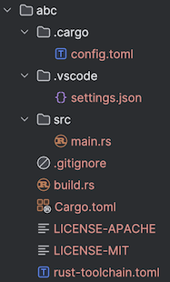

# Getting started with Embassy project

The folks at Espessif have prepared the [`esp-template`](https://github.com/esp-rs/esp-template) repo, to get started.

`esp-hal` documentation points to the command in [Creating a project](https://docs.esp-rs.org/esp-hal/esp-hal/0.18.0/esp32c3/esp_hal/#creating-a-project):

```
$ cargo generate esp-rs/esp-template
⚠️   Favorite `esp-rs/esp-template` not found in config, using it as a git repository: https://github.com/esp-rs/esp-template.git
🤷   Project Name: abc
🔧   Destination: /home/ubuntu/VL53L5CX-rust/abc ...
🔧   project-name: abc ...
🔧   Generating template ...
✔ 🤷   Which MCU to target? · esp32c3
✔ 🤷   Configure advanced template options? · true
✔ 🤷   Enable allocations via the esp-alloc crate? · false
✔ 🤷   Enable WiFi/Bluetooth/ESP-NOW via the esp-wifi crate? · false
✔ 🤷   Configure project to use Dev Containers (VS Code and GitHub Codespaces)? · false
✔ 🤷   Configure project to support Wokwi simulation with Wokwi VS Code extension? · false
✔ 🤷   Add CI files for GitHub Action? · false
✔ 🤷   The template is requesting to run the following command. Do you agree?
cargo fmt · yes
🔧   Moving generated files into: `/home/ubuntu/VL53L5CX-rust/abc`...
🔧   Initializing a fresh Git repository
✨   Done! New project created /home/ubuntu/VL53L5CX-rust/abc
```

This creates the following folder structure:




## Changes to do

**`rust-toolchain.toml`**

```diff
-channel = "nightly"
+channel = "stable"
```

We don't need `nightly` for RISC-V targets (and eventually, not for Xtensa, either).
