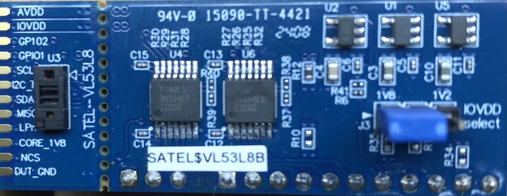
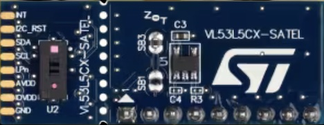
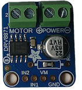
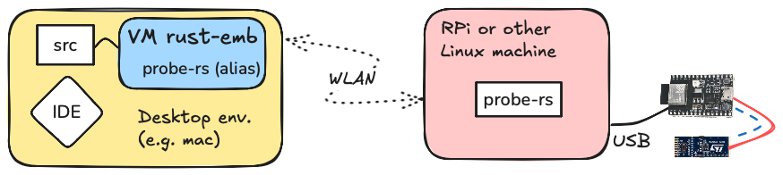
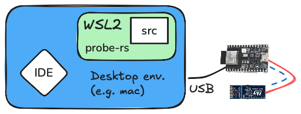

# Drivers for Embedded Rust

<!--

-->


<!-- ideas: on the storybook image, capacitors could be changed to motors, once BLDC support is factually there.
-->

Welcome to a small collection of drivers for Embedded [Rust](https://www.rust-lang.org) - especially [Embassy](https://embassy.dev)!

If you're like the author, you might have spent time:

- selecting the right part(s)
   - considering features, price and availability
- reading their documentation
- ensuring drivers fit
- learning the quirks that are not necessarily documented, anywhere

In particular, while the embedded Rust ecosystem has matured fast (2025 situation), and some MCU vendors (at least Espressif) provide great and ongoing Rust support, dealing with sensor X - in Rust - may be less pleasant. The aim of this repo is to smoothen that corner as well: to provide **great Rust support** for **selected third party sensors**.

**Which sensors will be supported?**

Some.

This repo covers sensors (things that measure stuff) and actuators (things that move stuff), interesting to its author.

**Why Embassy? (what is it?)**

Rust provides `async/await` support in the language, but you'll need an executor to actually use it. Embassy is such an executor (and much more) for embedded, `no-std` targets.

Writing `async` code allows concurrency to be dealt with as if only one thing moved at a time (which is not true). This is great for us humans - it makes source code shorter, more understandable and ... why *wouldn't* you want to program `async`!?

Embassy means to this repo that instead of polling your hardware (and consuming CPU cycles), your code will be *awaiting an interrupt*, and saving (battery) power until it's time to act!

>Examples that use Embassy are indicated by the postfix `.emb.rs`.

## Menu

||folder|what is it?|stability|comments|
|---|---|---|---|---|
|**Distance sensors**|
| *VL53L8*  *VL53L5CX*<br />*The actual sensors are the small components to the left.*|[`tof`](tof/README.md), [`tof/vl_api`](tof/vl_api/README.md)|Time-of-flight distance sensors; 4x4 (60Hz) or 8x8 (15Hz)|beta|VL53L8 and VL53L5CX sensors supported, over I2C bus.|
|**Wireless**|
|<br/>*BLE*|[`comms/ble`](comms/ble/README.md)|Working as custom Bluetooth (BLE) service|alpha|No external components needed; shows how to bake custom BLE interface into your project.|
|**Development kits**|
||[`devkit/rgb`](devkit/rgb/README.md)|RGB LED|WIP||
||[`devkit/button`](devkit/button/README.md)|Button|--||

<!-- #hidden; needs review
|**DC&nbsp;motor&nbsp;controllers&nbsp;(brushed)**|
||[`dc-motors/drv8871`](dc-motors/drv8871/README.md)|Controller for brushed (simple) DC motors - 6.5..45V, 3.6A max|WIP||
-->

<!--
||[`comms/extras/ble-web-app`](comms/extras/ble-web-app/README.md)|Web app for interfacing with the sample BLE service|--||
-->

### Folder structure

Each subfolder contains a structure similar to this:

```
built-in/
├── Cargo.toml      # Cargo build file
├── [DEVS/]         # Comments for development of the particular subfolder
├── README.md	    # start here
├── [WIRING.md]     # wiring of peripherals to MCU
├── build.rs        # additional build details
├── examples
│   └── button.rs   # examples you can run (if HW is properly set up)
├── [pins.toml]     # configuration of MCU pins
├── set-target.sh   # (link to a) tool to switch between MCU's
└── [src]           # library code
```

By keeping the folder structure similar, getting to speed with a new kind of sensor/actuator should be as swift as possible.


### MCU coverage

The repo focuses on ESP32 series MCU's; this is mainly so that the stated support remains maintained and tested. 

>The Rust / Embassy ecosystem, as such, provides the possibility to support more families; it's a matter of human effort. Let the author know if you'd like to become co-author, responsible for some other MCU's.

|MCU|dev board|support level|notes|
|---|---|---|---|
|ESP32&#x2011;C6|[ESP32-C6-DevKitM-01](https://docs.espressif.com/projects/esp-dev-kits/en/latest/esp32c6/esp32-c6-devkitm-1/user_guide.html)|used regularly|No problems!|
|ESP32&#x2011;C3|[ESP32&#x2011;C3-DevKitC-02](https://docs.espressif.com/projects/esp-dev-kits/en/latest/esp32c3/esp32-c3-devkitc-02/user_guide.html)|used sometimes|See below|

<!-- #hidden; `defmt` got more stable, less need to point this out?
>Note: The repo does debug logs using [defmt](https://defmt.ferrous-systems.com) which means JTAG support is essential, for any development work.
-->

#### ESP32-C3 considerations

- The chip does provide a built in USB/JTAG circuitry, but the suggested devkit doesn't have a connector for it. You can solder one, or (perhaps a better approach?), attach a cable to breakout pins on a breadboard. 

- I2C functionality - and possibly other time sensitive functionality - is known to suffer from a JTAG *specification issue* that affects `probe-rs`'s ability to interface with the chip. If you need long I2C communications, ESP32-C6 is the better chip to target.

	>[!NOTE]
	>The problem only involves debugging/logging over JTAG. You can quite well do long I2C transactions in production.


## Changing the target

Projects such as `esp-hal` use Cargo [features mechanism](https://doc.rust-lang.org/cargo/reference/features.html) for selecting the target MCU (e.g. `esp32c3` vs. `esp32c6`). While this seems to be the norm, this repo deviates from it.

The main reason is philosophical. Features should be used for - well - features of the code base, and they should be cumulative (by the Rust recommendations). Using features for MCU selection, however, are exclusive.

**So what do we do?**

There are `.config/cargo.toml` files under certain folders in the repo. These decide the MCU chip *for the particular folder* and its subfolders.

This means that you can, for example:

- use `dc-motors` code, targeting ESP32-C3, while..
- using `tof` code, targeting ESP32-C6

This at least matches the way the author works; there's always a particular breadboard wired for working with such software.

To change the folder's MCU target, 

```
$ cd dc-motors
$ $ ./set-target.sh 
1) esp32c3
2) esp32c6
Pick your target: 1

Going to edit:
- .cargo/config.toml
- ./drv8871/Cargo.toml

The edit is safe. You can see the changes made by 'git diff' (and revert by 'git restore --staged .cargo/config.toml ./drv8871/Cargo.toml').

Proceed? (Y/n) Y

Files '.cargo/config.toml' and './drv8871/Cargo.toml' now using:

   MCU:    esp32c3
   TARGET: riscv32imc-unknown-none-elf

Please 'cargo build' or 'cargo run', as usual.
```

You can see the change by `git diff`, i.e. the selected (default) MCU type gets stored in the version control.

This approach is a bit intrusive, but having used it for a while the author does prefer it over the `features` approach, at least for the case of the ZOO (full of examples). For publishing a library, using the feature mechanism is likely preferrable (or only working solution).


## Requirements (hardware)

- One of the dev kits mentioned above
- The necessary sensors (see particular subfolder)
- Breadboard
- Wires

Each sensor's subsection has a `WIRING.md` that shows suggested wiring. You can change the pin layout by editing the `pins.toml` file found in the same subfolder.

## Requirements (development environment)

The repo can be used in multiple ways. Here, we walk you through the two that the author is actively using:

- macOS + Multipass VM
- Windows + WSL2

What's important is that:

- you are running Ubuntu Linux on the command prompt
- you have a working setup for either [`probe-rs`](https://probe.rs) (or [`espflash`](https://github.com/esp-rs/espflash)) to reach your MCU

Please read this section to the end, and then decide how you'd like your setup to be.

>Below, we use terms:
>
>"desktop environment" = the OS you read your emails in


### macOS + Multipass VM



Pros:

- digital security: by using a VM, your build environment cannot reach your desktop environment - except for the source files which are mapped between the two
- electric safety: galvanic isolatation of MCU & wiring means no chance of frying your desktop computer (or laptop)
- tools added don't accumulate on your desktop environment; easy to start anew
- you can limit the amount of resources (disk, CPU) given to the build environment

Cons:

- managing Multipass
- Multipass needs a few hoops to get performance right
- need two computers
- need to use repos [`mp`](https://github.com/akauppi/mp) and [`probe-rs-remote`](https://github.com/finalyards/probe-rs-remote) to get the setup done right

Multipass is available also on Linux and Windows, making this a very OS-agnostic way to develop one's code. 

<!-- tbd. mention this in a `DEVS/IDEs.md` thingy
#### Role of the IDE

The author uses [Rust Rover](https://www.jetbrains.com/rust/), but without its remote 
-->

>#### Multipass and Windows
>
>For running Multipass on Windows, please note that **only Windows Pro has Hyper-V**. The author hasn't run Multipass on Windows (since WSL2 is there) but if he would, he'd pick a Pro license. You *can* run Multipass with Windows Home, but that involves VirtualBox. `#yuck`

<!-- #hidden
#### Shortcomings of Multipass

It's maintained by Canonical, but on somewhat limited resources. Some other virtualization product might suit you better. Also, it doesn't have USB pass-through but since we anyways prefer *physical isolation* from the MCU, that's not really an issue.

>Note! Since 1.14.0, the author has found Multipass to be somewhat more fragile than it was until then. This is, however, under control, and should not keep you from using the solution. More info is available in the [`mp`](https://github.com/akauppi/mp) repo.
-->

<!-- #hidden; stuff for a discussion board!?
#### Running on a single computer?

Fully possible. You just point `ssh` to your host, from the VM, and have `probe-rs` installed on the host. Perhaps you want to use a USB Isolator, in such a scenario?

Again, the benefit is that your Rust / embedded toolchains are sandboxed. Only `probe-rs` remains on the desktop environment, and is easy to install and update there (well, unless it needs a whole Rust environment?).
-->

### Windows + WSL2



Pros:

- easy to get going if you have a Windows machine 
- works also on Windows 10 Home
- only one computer is needed

Cons:

- no galvanic isolation from the MCU & wiring
- no digital safety: WSL2 can reach your main environment (it's *not* a sandbox)
- need to set up USB/IP, to reach the USB device in Linux (very smooth experience!)

The author uses this setup for travel (incl. visits to a Hacklab).

Note that in this setup, the source folders (your Git repos) should remain on the WSL2 partition. The Windows IDE's can reach them there, without problems, and the performance is *way better* this way.

Also note that - while WSL2 does use a Virtual Machine - there's no isolation between your development and desktop environments. They now run different OS'es, but you can still e.g. `touch /mnt/c/Users/{yourid}/Desktop/abc.txt`, i.e. create and use stuff from the desktop. This means, so can the libraries you are working with!!

<!--
>There may be some safety mechanisms in Windows + WSL2 the author is not aware of.
-->

Also, `probe-rs` in this case is installed within the WSL2, and accesses the devkit via USB/IP. USB/IP between a Windows host and WSL2 is *very smooth* and there's no reason for the `ssh` stuff.

This scenario is ideal if you want to work on a single computer, e.g. for taking demos out on the field a Windows laptop is sufficient!

>**Galvanic isolation**
>
>Consider using a [USB Isolator](https://www.amazon.de/s?k=usb+isolator) to protect your USB port. If you do, the author would like to hear your experiences.
>
>In particular, of interest: 
>
>- do they still provide power for the MCU?
>- does using one slow down the development (e.g. flashing), compared to directly fitting the MCU?


### Installation - which one shall it be?

<details><summary>**Installing Multipass setup**</summary>

- Visit the [`mp`](https://github.com/akauppi/mp) and [`probe-rs-remote`](https://github.com/finalyards/probe-rs-remote) repos, and try to get the setup running.
</details>

<details><summary>**Installing WSL2 setup**</summary>

- Set up USB/IP to see your MCU from the WSL2 prompt. Instructions in [`USBIP-WSL2`](https://github.com/finalyards/USBIP-WSL2).

- Install a Rust environment on WSL2, with:

	```
	$ rustup target add riscv32imc-unknown-none-elf
	$ rustup target add riscv32imac-unknown-none-elf
	```
- [Install `probe-rs`](https://probe.rs/docs/getting-started/installation/) either by:

	- curl; follow the `Linux` options
	- `cargo binstall probe-rs-tools`
	- `cargo install probe-rs-tools --locked`

	See the main page for comparison of the approaches.
</details>

**Testing:**
	
You should be able to (with MCU connected)..
	
```
$ probe-rs list
The following debug probes were found:
[0]: ESP JTAG -- 303a:1001:54:32:04:07:15:10 (EspJtag)
```
	
..get the list of MCU's you have connected to the auxiliary computer.

>Let the author know if there are gotchas - e.g. by creating an issue. 
		


### Summary

As you can see, there are some different ways to set up the toolchain.

What's important to take home from this is that

- The ZOO runs on Ubuntu Linux only. With virtualization, however, this should not limit your choices.
- `probe-rs` is the tool of choice for interacting with your development kit. The build scripts don't care whether such command leads to USB/IP or a `ssh`-bridged installation.

Good luck! ☀️☀️☀️


## Next steps

Visit the subfolders, pick any one you'd like to try. The instructions are within their particular `README.md`.

PLEASE [give feedback](https://github.com/lure23/ZOO-esp32/issues) on the GitHub! 

<!--
Developed on:

```
macOS 15.6
Multipass 1.16.1
```
-->
