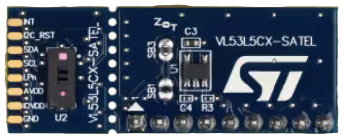

# Sensors with Rust and Embassy

<!-- tbd. Zoo picture & styling -->

## Aim of the repo

It's quite elaborate to take in new sensors to a project. It's about

- reading the documentation
- ensuring drivers fit
- learning the quirks that are not necessarily documented, anywhere

This repo plans to cover various sensors, interesting to the author, and provide reliable, maintained Rust (Embassy) bindings to them.

It does not aim to be a cover-it-all. You may suggest sensors to bring in, but likely it's better to start a similar repo for the sensors you feel strongly about - and are willing to maintain.


## Menu

||folder|what is it?|stability|comments|
|---|---|---|---|---|
||[`vl53l5cx_uld`](vl53l5cx_uld/README.md)|Time-of-flight distance sensor; 4x4 (60Hz) or 8x8 (15Hz), up to 400cm|Likely some changes but usable; beta||


### MCU coverage

The repo focuses on ESP32 series MCU's, but this is mainly so that the stated support remains maintained, and tested. **If you are ready to take on maintenance for other MCU's, let the author know**. The Rust / Embassy ecosystem, as such, provides us the possibility to keep the repo *very* MCU independent. That alone is great. 🎉🎉🎈🎈

|MCU|dev board|support level|notes|
|---|---|---|---|
|ESP32-C3|[ESP32-C3-DevKitC-02](https://docs.espressif.com/projects/esp-dev-kits/en/latest/esp32c3/esp32-c3-devkitc-02/user_guide.html)|used regularly|To use JTAG, you'll need to solder some wires.<br />I2C functionality is known to suffer from a `TimeOut` issue (that doesn't happen on the ESP32-C6).|
|ESP32-C6|[ESP32-C6-DevKitM-01](https://docs.espressif.com/projects/esp-dev-kits/en/latest/esp32c6/esp32-c6-devkitm-1/user_guide.html)|used regularly||
|(ESP32)|[Adafruit ESP32 Feather V2](https://www.adafruit.com/product/5400)|2nd tier|ESP32 code is in another branch that's updated *on request*.<br />Rust support for Xtensa (which this one is) still needs a separate `espup` utility (and is based on `nightly`), unlike RISC V targets, which are mainstream and can be targeted with stable Rust. This is only an initial speed bump, however. Instructions for setting up the toolchain are in the particular branch.<br />Doesn't have built-in JTAG support so you'll need to purchase an adapter, e.g. ESP-Prog, for debug logging|

>Note: The repo does debug logs using [defmt](https://defmt.ferrous-systems.com) which means JTAG support is highly recommended, for any development work.

<!-- #whisper
It's of course also possible to log to UART, and not need JTAG. The choice of DEFMT is one of the simplifying choices made in this repo, to keep possible configurations to a somewhat manageable dimension. For any semi-professional work, using JTAG is the way to go.
-->


## Requirements (hardware)

- One of the dev kits mentioned above
- The necessary sensors
- Breadboard
- Wires

Each sensor's subsection has a `WIRING.md` that shows suggested wiring.

### The computers setup


*Image 1. Development setup with Multipass and USB/IP*
<!-- editor's note: Original is stored in `../.excalidraw/` 
-->

The repo can be used in many ways. The setup the author prefers is shown in Image 1, above.

- Code editing happens on a host (Mac), using an IDE (Rust Rover)
- Compilation happens in a virtual machine (using [Multipass](https://multipass.run) for this); the whole Rust and embedded toolchain *only needs to be installed within here*.
- Hardware devices (MCU + sensors) are connected to *another PC* that runs `usbipd` (a USB/IP server).

   The author uses Windows 10 Home for this, and recommends the setup. Using a Raspberry Pi for sharing the device would be nice, but the author failed to get it all the way. Contributions on this are WELCOME!!

>Note: Where it says "Ethernet" in the view actually means WLAN. The software development and hardware setups are fully air-gapped from each other.

#### Shortcomings of USB/IP

- Programming the boards (ESP32-C3, ESP32-C6) are slightly slower than in a direct connection:

   ||flash speed|..seconds|
   |---|---|---|---|
   |USB/IP|2..3 KiB/s|~30 <!-- tbd. more precise-->|
   |WSL2|tens to 100 KiB/s <!-- tbd. make more precise-->|~5|

<!-- VM + USB/IP (reference):
probe-rs run --speed=200 --log-format '{t:dimmed} [{L:bold}] {s}' target/riscv32imac-unknown-none-elf/release/examples/multiboard
      Erasing ✔ [00:00:02] [####################################################################################################################] 256.00 KiB/256.00 KiB @ 92.27 KiB/s (eta 0s )
  Programming ✔ [00:00:44] [#####################################################################################################################] 107.53 KiB/107.53 KiB @ 2.41 KiB/s (eta 0s )    Finished in 44.580067s
-->

<!-- WSL2 (reference) 
tbd.
-->

#### Shortcomings of Multipass

- You cannot bind USB devices to the VM; that's why we use USB/IP

	With other virtualization tools, you could virtually attach the development kit directly.

- Mounting folders with lots of small files (e.g. Cargo's `target` folder) may be slowish.

   *tbd. build speed comparison between Multipass and WSL2 setups.*

#### Conclusion: your setup!

If you have only a single computer, that's fine. Plug the USB's to it; install stuff natively. Or use a virtualization setup that shares the USB ports. Or install Multipass on the *same* computer where your VMs are. To find the right options, we should set up some discussion board, really (not planned).

What's important is that the development environment will only be maintained in Linux (and Ubuntu/Debian variant at that). This is where Multipass comes in so handy, providing support for all macOS, Windows and Linux desktop OSes.

>Note: If you run WSL2, that's fine (it is Ubuntu, after all). The author occasionally does this, but support may be shaky.

<div >

>Note: For running Multipass on Windows, please note that only Windows Home has Hyper-V hypervisor support. You *can* run Multipass with Windows Home, but the author rather uses WSL2 with that OS. <!-- tbd. in 2025, I hopefully have Windows Pro + Multipass as a properly supported setup-->

Good luck! ☀️☀️☀️


## Requirements (software)

### VM setup

Set up the development environment using [`mp`](https://github.com/akauppi/mp) repo, especially `rust+emb` folder within it.

We airgap the electronics from the main development computer using USB/IP (anyways needed because of Multipass). If you follow the suggested VM setup, this means you don't have to install anything except for an IDE and [Multipass](https://multipass.run) on your host computer.

>The author uses macOS as a host, but both Windows and Linux should work the same.

>Note: If you don't like using Multipass, you can try other approaches. Everything should work as long as you're in Linux VM (e.g. WSL2 on Windows). See the shell scripts within the `mp` repo to find out, how to install tooling. Using a VM sandboxes your development environment from your main account, which is the reason the author prefers it. If you do things differently, you are on your own. :)


### Basic `rust+emb` setup

The subfolders expect you to have a virtual machine prepped with the `rust+emb/prep.sh` command of the [`akauppi/mp`](https://github.com/akauppi/mp) repo.

Using `mp` allows you to easily re-create a Rust (and Embassy) capable VM, if you need to.

>![TIP]
>If you are building code natively (or e.g. using WSL2), have a look at the `rust` and `rust+emb` folders of `mp` - and replicate the install commands from there, manually.


### [ESP32-C3] Check `probe-rs` version

To get an ESP32-C3 -specific [fix](https://github.com/probe-rs/probe-rs/pull/2748) (until >0.24.0 is out):

- Install `git` CLI

	```
	$ sudo apt install git
	```

	This matters for `cargo` - *[details if you want to read them](https://github.com/probe-rs/probe-rs/issues/2816)*.

- Install a **specific revision** of `probe-rs`:

   ```
   $ cargo install --git https://github.com/probe-rs/probe-rs --rev 0fb93950 probe-rs-tools --locked --force
   ```

- Test by:

   ```
   $ probe-rs --version
	probe-rs 0.24.0 (git commit: 0fb93950)
   ```

<!-- tbd. remove this section once >= 0.24.1 is out -->

---

Developed on:

```
macOS 14.6
Multipass 1.14.0
ESP32-C3-Devkit-C02 (revision 0.4) and ESP32-C6-DevKitM-1 
VL53L5CX-SATEL (marking "PCB4109A")
bindgen 0.70.1
```

