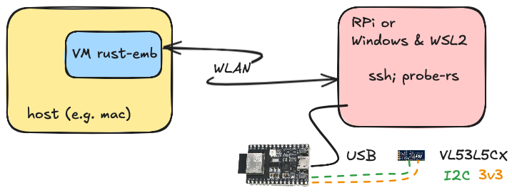

# VL53L5CX with Rust and Embassy

## Background

The ST [VL53L5CX](https://www.st.com/en/imaging-and-photonics-solutions/vl53l5cx.html) is a tiny (6.4 x 3.0 x 1.5 mm) surface mounted, matrix capable laser distance meter. It is interfaced with I²C but the [native C library](https://www.st.com/en/embedded-software/stsw-img023.html) really is the way it needs to be steered with - I²C communication details are undocumented.

This library aims to steer the sensor (multiple of them!) using `async` Rust via [Embassy](http://embassy.dev/).

### Other projects / prior art

- [`kriswiner/VL53L5CX`](https://github.com/kriswiner/VL53L5CX) (GitHub; 2021)
- [`simondlevy/VL53L5CX`](https://github.com/simondlevy/VL53L5CX) (GitHub; 2021)

	<!-- tbd.!!! Once public, mention to those two, especially Simon - he's worked on ESP32, at some point.
	-->

## Requirements (hardware)

### Parts

- A pair of VL53L5CX sensors

	>The [VL53L5CX-SATEL](https://www.digikey.fi/fi/products/detail/stmicroelectronics/VL53L5CX-SATEL/14552430) development board is likely the one you will need. Each package contains two boards.

- ESP32-C3 (or similar) MCU

  - with a [USB soldered for JTAG access](https://docs.espressif.com/projects/esp-idf/en/latest/esp32c3/api-guides/jtag-debugging/configure-builtin-jtag.html)
  
- breadboard and wires to connect the two


*Image 1. Development setup*
<!-- editor's note: Original is stored in `../.excalidraw/` 
-->

*tbd. Wiring details*

## Requirements (software)

### VM setup

Set up the development environment using [`mp`](https://github.com/akauppi/mp) repo, especially `rust+emb` folder within it.

We airgap the electronics from the main development computer using USB/IP (anyways needed because of Multipass). If you follow the suggested VM setup, this means you don't have to install anything except for an IDE and [Multipass](https://multipass.run) on your host computer.

>The author uses macOS as a host, but both Windows and Linux should work the same.

>Note: If you don't like using Multipass, you can try other approaches. Everything should work as long as you're in Linux VM (e.g. WSL2 on Windows). See the shell scripts within the `mp` repo to find out, how to install tooling. Using a VM sandboxes your development environment from your main account, which is the reason the author prefers it. If you do things differently, you are on your own. :)


### `bindgen`

Install dependencies:

```
$ sudo apt install llvm-dev libclang-dev clang
```

```
$ cargo install bindgen-cli
```

>Note: Bindgen docs recommend using it as a library, but we prefer to use it as a command line tool.

### Check `probe-rs` version

>Note: The `rust-emb` VM contains a suitable `probe-rs`. If you're using it, you can skip to the next section.

You want an ESP32-C3 -specific [fix](https://github.com/probe-rs/probe-rs/pull/2748), so either:

- check that your version is > 0.24.0
- ..or install from sources:

   ```
   $ cargo install --git https://github.com/probe-rs/probe-rs probe-rs-tools --force
   ```

### The vendor C libary

The [VL53L5CX_ULD library](https://www.st.com/en/embedded-software/stsw-img023.html) is a separate download.

1. Fetch it from ST (link above)
2. Place the `VL53L5CX_ULD_driver_2.0.0` folder to `vl53l5cx_uld/`

	Note that while you need to `Agree` to the larger ST.com license, it has the clause: 
	
	>Open Source Software [...] is not subject to the terms of this PLLA to the extent [...]

<!-- Developed on
macOS 14.6
Multipass 1.14.0
ESP32-C3-Devkit-C02 (revision 0.4) and ESP32-C6-DevKitM-1 
VL53L5CX-SATEL (marking "PCB4109A")
bindgen 0.70.1
-->


## Subprojects

```
$ cd vl53l5cx_uld
```

Follow instructions in its [`vl53l5cx_uld/README`](vl53l5cx_uld/README.md).


<!--
## Tests
etc..
-->


## References

### VL53L5CX

- [Breakout Boards for VL53L5CX](https://www.st.com/en/evaluation-tools/vl53l5cx-satel.html) (ST.com)
- [Ultra Lite Driver (ULD) for VL53L5CX multi-zone sensor](https://www.st.com/en/embedded-software/stsw-img023.html) (ST.com)

	- ["Ultra lite driver (ULD) [...] with wide field of view"](https://www.st.com/resource/en/data_brief/stsw-img023.pdf) (PDF, May'21; 3pp)
	- ["A guide to using the VL53L5CX multizone [...]"](https://www.st.com/resource/en/user_manual/um2884-a-guide-to-using-the-vl53l5cx-multizone-timeofflight-ranging-sensor-with-a-wide-field-of-view-ultra-lite-driver-uld-stmicroelectronics.pdf) (PDF, revised Feb'24; 18pp)

		<font size=5 color=red>⇫</font> The main API usage guide

	- [Software licensing agreement](https://www.st.com/resource/en/license_agreement/dm00484327.pdf) (PDF, Feb'18; 5pp)
