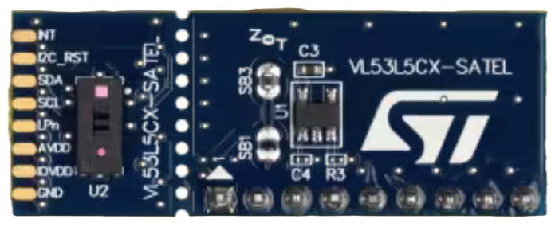

# Embedded Zoo - Sensors and Actuators 

## ..with [Rust](https://www.rust-lang.org) and [Embassy](https://embassy.dev)

<!-- tbd. Zoo picture & styling -->

It's quite elaborate to take in new sensors to a project. It's about:

- selecting the right part(s)
   - considering sourcability, price, features
- reading the documentation
- ensuring drivers fit
- learning the quirks that are not necessarily documented, anywhere

This repo covers various sensors (things that measure stuff) and actuators (things that make other things move), interesting to its author, and provides reliable, maintained Rust (Embassy) bindings to them.


## Menu

||folder|what is it?|stability|comments|
|---|---|---|---|---|
|**DC&nbsp;motors &&nbsp;controllers** (brushed)|
||[`dc-motors/drv8871`](dc-motors/drv8871/README.md)|Controller for brushed (simple) DC motors - 6.5..45V, 3.6A max|WIP||
|**Time of flight** = distance sensors|
||[`tof/vl53l5cx_uld`](tof/vl53l5cx_uld/README.md)|Time-of-flight distance sensor; 4x4 (60Hz) or 8x8 (15Hz), up to 400cm|beta||


### MCU coverage

The repo **focuses on ESP32 series MCU's**, but this is mainly so that the stated support remains maintained and tested. **If you are ready to take on maintenance for other MCU's, let the author know**. The Rust / Embassy ecosystem, as such, provides us the possibility to keep the repo *very* MCU independent. That alone is great. 🎉🎉🎈🎈

|MCU|dev board|support level|notes|
|---|---|---|---|
|ESP32&#x2011;C3|[ESP32&#x2011;C3-DevKitC-02](https://docs.espressif.com/projects/esp-dev-kits/en/latest/esp32c3/esp32-c3-devkitc-02/user_guide.html)|used regularly|See below.|
|ESP32&#x2011;C6|[ESP32-C6-DevKitM-01](https://docs.espressif.com/projects/esp-dev-kits/en/latest/esp32c6/esp32-c6-devkitm-1/user_guide.html)|used regularly|No problems!|
|(ESP32)|[Adafruit ESP32 Feather V2](https://www.adafruit.com/product/5400)|2nd tier|ESP32 code is in a branch that's updated *on request*.<br />Rust support for Xtensa (which this one is) still needs a separate `espup` utility, unlike RISC V targets, and `stable` Rust cannot be used on it. This is only an initial speed bump, however. Instructions for setting up the toolchain are in the particular branch.<br />*Doesn't have built-in JTAG* support so you'll need to purchase an adapter, e.g. [ESP-Prog](https://docs.espressif.com/projects/esp-iot-solution/en/latest/hw-reference/ESP-Prog_guide.html), for debug logging.|

>Note: The repo does debug logs using [defmt](https://defmt.ferrous-systems.com) which means JTAG support is highly recommended, for any development work.

#### ESP32-C3 considerations!!

- To use JTAG, you'll need to solder a USB wire. Otherwise, the chip itself does provide a built in USB/JTAG circuitry (just like ESP32-C6 does).

- I2C functionality - and possibly other time sensitive functionality - is known to suffer from a JTAG *specification issue* that affects `probe-rs`'s ability to interface with the chip. There used to be a "fix" for this in `probe-rs` but that wasn't kept in the code base. If you need long I2C communications, ESP32-C6 is the better chip to target.

	Note: The problem only involves debugging (over JTAG). You can quite well do long I2C transactions in production.

#### ESP32 considerations!!

The support will be available as a separate branch, because it needs more changes than simply changing the `target` (`.cargo/config.toml`) and `feature` (`Config.toml`) that our chip selection script manages.


## Changing the target

Projects such as `esp-hal` use the Rust feature mechanism for selecting the target MCU (e.g. `esp32c3` vs. `esp32c6`). While this seems to be the norm, this repo deviates from it.

The main reason is philosophical. Features should be used for - well - features of the code base, and they should be cumulative (by the Rust recommendations). MCU features, on the other hand, are exclusive.

**So what do we do?**

There are `.config/cargo.toml` files under certain folders in the repo. These decide the MCU chip *for the particular folder* and its subfolders.

This means that you can, for example:

- use `dc-motors` code, targeting ESP32-C3, while..
- using `tof` code, targeting ESP32-C6

This at least matches the way the author works; there's always a particular breadboard connected with such software.

To change the folder's MCU target, 

```
$ cd dc-motors
$ $ ./set-target.sh 
1) esp32c3
2) esp32c6
Pick your target: 1

Going to edit:
- .cargo/config.toml
- ./drv8871/Cargo.toml

The edit is safe. You can see the changes made by 'git diff' (and revert by 'git restore --staged .cargo/config.toml ./drv8871/Cargo.toml').

Proceed? (Y/n) Y

Files '.cargo/config.toml' and './drv8871/Cargo.toml' now using:

   MCU:    esp32c3
   TARGET: riscv32imc-unknown-none-elf

Please 'cargo build' or 'cargo run', as usual.
```

You can see the change by `git diff`, i.e. the selected (default) MCU type gets stored in the version control.

This approach is a bit intrusive, but having used it for a while the author does prefer it over the `features` approach, at least for the case of the Zoo (which is full of examples). For publishing a library, using the feature mechanism is likely preferrable (or only working solution).


## Requirements (hardware)

- One of the dev kits mentioned above
- The necessary sensors (see particular subfolder)
- Breadboard
- Wires

Each sensor's subsection has a `WIRING.md` that shows suggested wiring. You can change the pin layout by editing `pins.toml` files found in each subfolder.

### The computers setup


<!--
*Image 1. Development setup with Multipass and USB/IP*
-- Original is stored in `.excalidraw/` -->

The repo can be used in many ways. The setup the author prefers is shown above.

- Code editing happens on a host (Mac), using an IDE (Rust Rover)
- Compilation happens in a virtual machine (using [Multipass](https://multipass.run) for this); the whole Rust and embedded toolchain *only needs to be installed within here*.
- Hardware devices (MCU + sensors) are connected to *another PC* that runs `usbipd` (a USB/IP server).

>Ideally, the "other PC" could be a Raspberry Pi, but the author had issues setting up `usbipd` server there. This can be done - if you do it, please share the detailed steps! `:)`

>Note: Due to using WLAN, the software development and hardware setups are fully air-gapped from each other.

#### Shortcomings of USB/IP over Ethernet

- Programming the boards (ESP32-C3, ESP32-C6) is considerably slower than in a comparison case (USB/IP to WSL2):

   ||flash speed|..seconds|
   |---|---|---|---|
   |USB/IP between computers|2..3 KiB/s|~30..40|
   |USB/IP to WSL2|~20 KiB/s|~5..6|


<!-- VM + USB/IP (reference):
probe-rs run --log-format '{t:dimmed} [{L:bold}] {s}' target/riscv32imac-unknown-none-elf/release/examples/multiboard
      Erasing ✔ [00:00:02] [####################################################################################################################] 256.00 KiB/256.00 KiB @ 92.27 KiB/s (eta 0s )
  Programming ✔ [00:00:44] [#####################################################################################################################] 107.53 KiB/107.53 KiB @ 2.41 KiB/s (eta 0s )    Finished in 44.580067s
-->

<!-- WSL2 (reference) 
tbd.
-->

#### Shortcomings of Multipass

- You cannot bind USB devices to the VM; that's why we use USB/IP. With other virtualization tools, you could virtually attach the development kit directly.

- `[solved]` Mounting folders with lots of small files (Cargo's `target` folder) is slow.

	The `mp` setup now uses a joint `~/target` folder for all the projects. This works, and having the files within the VM file system (as opposed to mapped to the host) speeds up `cargo` operations essentially (factor of 20..40!).

#### Conclusion: your setup!

If you have only a single computer, that's fine. Plug the USB's to it; install stuff natively. Or use a virtualization setup that shares the USB ports. Or install Multipass on the *same* computer where your devices are.

What's important is that the development environment will only be maintained in Linux (Ubuntu). This is where Multipass comes in so handy, providing support for all macOS, Windows and Linux desktop OSes.

>Note: If you run WSL2, that's fine (it is Ubuntu, after all). The author occasionally does this (his second platform).

<div >

>Note: For running Multipass on Windows, please note that only Windows Pro has Hyper-V hypervisor support. You *can* run Multipass with Windows Home, but the author rather uses WSL2.

Good luck! ☀️☀️☀️


## Requirements (software)

### Basic `rust+emb` setup

The subfolders expect you to have a virtual machine prepped with the `rust+emb/prep.sh` command of the [`akauppi/mp`](https://github.com/akauppi/mp) repo.

Using `mp` allows you to easily re-create a Rust (and Embassy) capable VM, if you need to.

>Note: If you don't like using Multipass, you can try other approaches. See the shell scripts within the `mp` repo to find out, how to install tooling. Using a VM sandboxes your development environment from your main account, which is the reason the author prefers it. If you do things differently, you are on your own. :)


## Support files

Each of the folders may contain such files / subfolders:

- `DEVS/*.md`

	Deeper commentary that is not necessary for *using* the repo, but may be important for understanding / co-developing it. Design decisions, etc. These files are treated less formally than `README´s.

- `TROUBLES.md`

	List of known issues, and possible steps to overcome them.

---

Developed on:

```
macOS 15.0
Multipass 1.14.1
ESP32-C3-Devkit-C02 (revision 0.4) 
ESP32-C6-DevKitM-1
```
