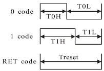

# SmartLed (SK68XX, WS2812B)

The smart LED on ESP32-C3-DevKitC02 (V1.1) is a "SK68XXMINI-HS" `|1|`.

For the ESP32-C6 boards, it's a "WS2812B" `|2|``|3|`.

These two are similar, but differ slightly by their timing specs. This document discusses, how to control them from an MCU.

<small>
`|1|`: [ESP32-C3-DevKitC-02 schematics, V1.1](https://dl.espressif.com/dl/schematics/SCH_ESP32-C3-DEVKITC-02_V1_1_20210126A.pdf)
 
`|2|`: [ESP32-C6-DevKitC-1 schematics, V1.4](https://dl.espressif.com/dl/schematics/esp32-c6-devkitc-1-schematics_v1.4.pdf)
 
`|3|`: [ESP32-C6-DevKitM-1 schematics, V1.0](https://dl.espressif.com/dl/schematics/esp32-c6-devkitm-1-schematics.pdf)
</small>

## Common 

>

For sending a `0`, pulse like above. Ditto for `1`. 

Data is 24 such pulses; GRB format; MSB first (i.e. G7..0, R7..0, B7..0).

If there are multiple 24-pulse patterns, the tail is passed on to other LEDs (the DevKits have only a single LED, not a strip).

To end a frame, the output is kept low for a slightly longer time (varies by LED type, see below).

## SK68XXMINI-HS

>[!NOTE]
>The datasheet shows "+3.7 .. 5.5 V" voltage range. However, the ESP32-C3-DevKitC02 schematic has the LED's VDD as 3.3V. Seems to work.

<!--
- Speed of data transmission: 800 kHz
-->

In this model, the high times are defined, but the trailing low times are looser.

**Detailed timings**

Pulse length: TH+TL >= 1.2µs.

||length|valid range|
|---|---|---|
|T0H|0.32 µs|0.2 .. 0.4 µs|
|T0L|>= 0.8 µs|(< 20 µs)|
|---|
|T1H|0.64 µs|0.62 .. 1.0 µs|
|T1L|>= 0.2 µs|(< 20 µs)|

End condition (reset): Low > 80 µs.
 
Author's opinion: This spec is way more ambiguous than the WS2812B's (below). When implementing it, we can be rather more strict than what the spec itself would allow (i.e. be fast).

>The `esp-hal-smartled` [code has some mentions](https://github.com/esp-rs/esp-hal-community/blob/main/esp-hal-smartled/src/lib.rs#L61-L65) of SK68XX, though it does not point the LED type to particular DevKits.
>
>It uses:
>
>- code period 1.25 µs (= 1/800kHz); ✅
>- T0H 400 ns; upper end of the spec
>- T0L derived
>- T1H 850 ns; ✅
>- T1L derived

<!-- Editor's note
The spec table has "max" left empty, but its text says this: "The low time requirement of “0” code and “1“ code is less than 20 µs."

That seems to indicate that there is a max for the low signal, and it makes sense to be less than the reset time.
-->

## WS2812B

**Detailed timings**

Pulse length: TH+TL = 1.25µs ±600ns.

||length|margin|
|---|---|---|
|T0H|0.4 µs|±150 ns|
|T0L|0.8 µs|±150 ns|
|---|
|T1H|0.85 µs|±150 ns|
|T1L|0.45 µs|±150 ns|

End condition (reset): keep the output low at least 50µs.

<!--
>[this blog](https://cpldcpu.com/2014/01/14/light_ws2812-library-v2-0-part-i-understanding-the-ws2812/) shows the timings as 0.35 us, 0.9 us, for both 0 and 1. More pleasing, mathematically, and within the margins of error.
-->

## References

- [SK68XXMINI-HS datasheet](https://www.rose-lighting.com/wp-content/uploads/sites/53/2020/05/SK68XX-MINI-HS-REV.04-EN23535RGB-thick.pdf), by Shenzen Rose Lighting Technology Co. (2018)

- [WS2812B data sheet](https://cdn-shop.adafruit.com/datasheets/WS2812B.pdf), hosted by Adafruit (unversioned, no date) > "Data transfer time"

	Bad language, but tables are reasonable. Start from the end. ;)
