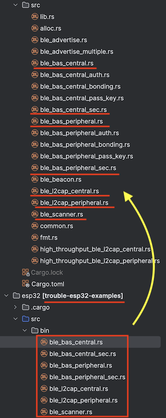

# Studying TrouBLE sources

In case you go through [https://github.com/embassy-rs/trouble](https://github.com/embassy-rs/trouble), here might be some guidance. Notes by the author, looking at the `b7d9238` situation (21-Sep-25); post 0.3.0.

## Issues


## Samples



The layout here is practical, but a bit strange:

- `trouble-esp32-examples` - and other platform specific crates - derive their platform-agnostic parts from `trouble-example-apps` (in `../apps`).

	This is likely so that each platform can pull in their particular implementation crates. It all makes sense. 
	
	>Idea? What could make this more intuitive is just change in the naming:
	>
	>`trouble-example-apps` -> `trouble-examples` (not mentioning the platform; following the platform specific pattern, instead of playing with the `apps`.
	>
	>The "apps" doesn't actually add any value, does it? I'd rather call it "logic" (like business logic)
	>
	>One could even rename the folder `apps` -> `_logic`; the underscore emphasizing people should not directly go there; but in the platform specific folder. If so, call the package `trouble_examples_logic` - then it reads well in the platform specific `use` statements.


Note that only some of the **apps** examples are implemented in `esp32`-specific project. These each have matching names in the **apps** folder.

### `ble_bas_central.rs`

Example for making a central (that can discover and talk to a peripheral).

Reads attributes from a peripheral, every 10s. 

Prints out notifications, once/if they arrive.

### `ble_bas_central_sec.rs`

Adds random number generator to `ble_bas_central`. The author thinks this means such on-air comms will be encrypted (just a hunch).

### `ble_bas_peripheral.rs`

Example for making a peripheral.

### `ble_bas_peripheral_sec.rs`

Peripheral with encryption.

When exercising the peripheral (subscribe to Battery Level characteristic's notifications, in nRF Connect for Mobile), the log:

```
INFO - [smp] Pairing method JustWorks
INFO - [custom_task] notifying connection of tick 20
INFO - [custom_task] RSSI: -40
INFO - [custom_task] notifying connection of tick 21
INFO - [custom_task] RSSI: -38
INFO - [smp] Just works pairing with compare 528326
INFO - Enabling encryption for Identity { bd_addr: BdAddr([207, 10, 117, 116, 244, 111]), irk: None }
INFO - Link encrypted!
INFO - [gatt] pairing complete: Encrypted
```

We can see that subscription leads to a pairing, and the connection gets encrypted.


### `ble_l2cap_central.rs`

Not interesting to us, since Web Bluetooth API wouldn't support L2CAP protocol.

### `ble_l2cap_peripheral.rs`

### `ble_scanner.rs`


### Comments on lines:

```
    let address: Address = Address::random([0xff, 0x8f, 0x1a, 0x05, 0xe4, 0xff]);
```

If I recall right, the address is kept fixed (it is certainly not random), to ease debugging, or something like that. Having the `::random` comes from the Bluetooth specs - or something. You can also initialize it from a random slice.

>Yes, in one other place (`ble_bas_central.rs`), it's commented:
>
>```
>    // Using a fixed "random" address can be useful for testing. In real scenarios, one would
>    // use e.g. the MAC 6 byte array as the address (how to get that varies by the platform).
>```


