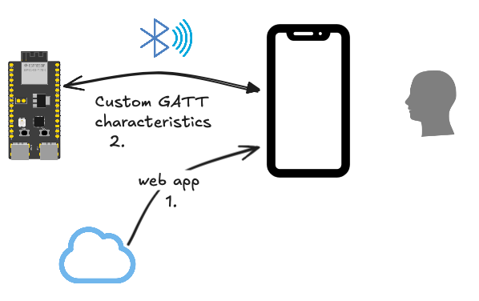
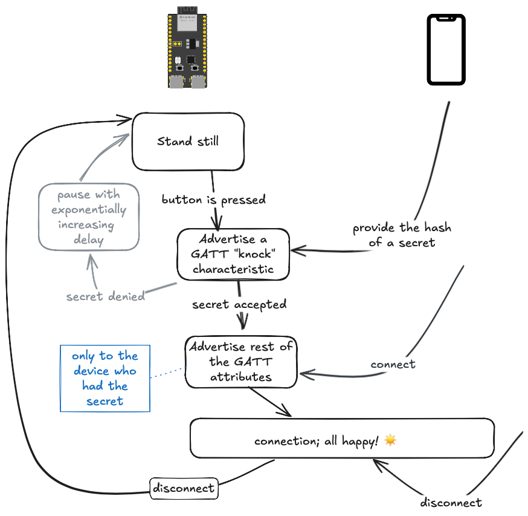
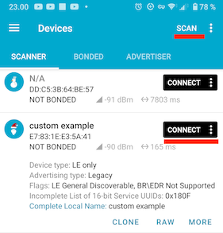
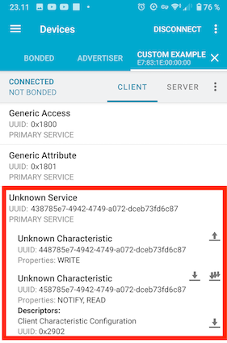
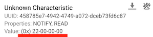

# Bluetooth Low Energy

Exposing an ESP32 device via the *Bluetooth Low Energy* protocol.

- with security 
- and encryption

We use the GATT profiles, making the BLE service usable from a Web Bluetooth API client (no native apps are involved).


## Background

### BLE vs. Bluetooth Classic

The BLE protocol is independent of the "Bluetooth Classic" stack (which continues to co-exist with it). It is intended for **fitness**, **home automation** and **internet-of-things** use cases, i.e. anywhere where battery powered devices with non-frequent charging opportunities abound.

Some devices (like most Espressif's and all of Nordic Semiconductor's) only support BLE, not the classic profiles. Likewise, some libraries (e.g. [TrouBLE](https://github.com/embassy-rs/trouble)) are BLE only.


## Sample case



BLE, together with *Web Bluetooth API*<sup>`|1|`</sup> allows one to make mobile user interfaces that:

- directly interface with a BLE device
- don't need any installation

This is widely beneficial for embedded systems, since the UI can be completely detached from the embedded product. This folder, and a [related repo](http://github.com/finalyards/ZOO-BLE-webapp) that provides the web app aim to show how this can be done.

<small>
1. [Communicating with Bluetooth devices over JavaScript](https://developer.chrome.com/docs/capabilities/bluetooth) (Chrome docs)
</small>

### Security

The dance goes like this:



*Figure 2. **Preliminary** thought on security*

You'd need not only be in the vicinity of the device, but also know a secret.

- [ ] add info about pairing and bonding (how it happens on later meets)
- [ ] consider hashed secret vs. blinking lights N times.. :)


## Requirements

- ESP32-C6 or ESP32-C3 devkit

	>for ESP32-C3 devkit, [a JTAG/USB cable](https://docs.espressif.com/projects/esp-idf/en/stable/esp32c3/api-guides/usb-serial-jtag-console.html) must be connected

No wiring is required.

### Debug tooling

Consider installing [nRF Connect for Mobile](https://play.google.com/store/apps/details?id=no.nordicsemi.android.mcp) (Google Play store<sup>`|1|`</sup>) on your mobile phone or tablet - and learning to use it.

The tool allows you to "see" the BLE environment and read/write/listen to GATT characteristics of your embedded device. We use it here for manually testing that the service functions.

You also get an idea, what kind of tools malicious users might try to use, to break into your connection - i.e. it gives a nudge for building in security.

<small>
`|1|`: ; available also on [App Store](https://apps.apple.com/fi/app/nrf-connect-for-mobile/id1054362403) (iOS) and as [nRF Connect for Desktop](https://www.nordicsemi.com/Products/Development-tools/nRF-Connect-for-Desktop) (Win64/Linux/macOS)
</small>


## Steps

### Build and launch the example

```
DEFMT_LOG=debug cargo build --release --features=defmt --example custom-emb
   Compiling comms-ble v0.0.0 (/home/ubuntu/ZOO.comms/comms/ble)
    Finished `release` profile [optimized + debuginfo] target(s) in 5.52s
probe-rs run --log-format '{t:dimmed} [{L:bold}] {s}' /home/ubuntu/target/riscv32imc-unknown-none-elf/release/examples/custom-emb
      Erasing ✔ 100% [####################] 384.00 KiB @  63.41 KiB/s (took 6s)
  Programming ✔ 100% [####################] 169.39 KiB @   1.15 KiB/s (took 2m)                                                                                                   Finished in 146.69s
1.775622 [INFO ] esp-wifi configuration EspWifiConfig { rx_queue_size: 5, tx_queue_size: 3, static_rx_buf_num: 10, dynamic_rx_buf_num: 32, static_tx_buf_num: 0, dynamic_tx_buf_num: 32, csi_enable: false, ampdu_rx_enable: true, ampdu_tx_enable: true, amsdu_tx_enable: false, rx_ba_win: 6, max_burst_size: 1, country_code: "CN", country_code_operating_class: 0, mtu: 1492, tick_rate_hz: 100, listen_interval: 3, beacon_timeout: 6, ap_beacon_timeout: 300, failure_retry_cnt: 1, scan_method: 0 }
1.776713 [DEBUG] BT controller compile version aa16a46
1.778944 [DEBUG] !!!! unimplemented srand 628
1.779255 [DEBUG] The btdm_controller_init was initialized
1.890409 [INFO ] Our address = Address { kind: AddrKind(1), addr: BdAddr([0, 0, 0, 30, 131, 231]) }
1.890707 [INFO ] Starting advertising and GATT service
2.273618 [INFO ] [host] filter accept list size: 12
2.359108 [INFO ] [host] setting txq to 12
2.359182 [INFO ] [host] configuring host buffers (8 packets of size 251)
2.436892 [INFO ] [host] initialized
2.612219 [INFO ] [adv] advertising
[...]
```

That means the service is running on ESP32 and being "advertised", i.e. discoverable by clients.


### Confirm that the service is seen

Using the [nRF Connect for Mobile](https://play.google.com/store/apps/details?id=no.nordicsemi.android.mcp) tool:

- Scan the BLE neighbourhood
- you should see the device advertising itself as `"custom example"`
- `CONNECT` with it

	>

- check its services and characteristics

	>

	The icons show which characteristics you can write to (up arrow), read from (down arrow), or be notified of changes (three down arrows).
	
	>[!NOTE]
	>Please ignore the "Unknown" titles. It simply means that the UUID's are not within the set of standardized services/characteristics of the Bluetooth specification. You cannot set them, anyways, and `nRF Connect for Mobile` could simply list them as "Custom". The UUID's are what matters.

### Observe the data (in real time)

Press the three-down-arrows (notify) icon.

>

Note that the value keeps increasing, once a second.

This could be any measurement you are observing, off the ESP32 device. It is transmitted *on demand*, the *device* making the initiative of telling the BLE stack that something has changed. It *is* cool.

### Show your color

One of the characteristics is for steering the RGB LED on the devkit. Provide three-byte values for its red, green and blue components, to set it to different values.

<!--
*tbd. image*
-->

### Logs

While that happened, the ESP32 has provided some logs, telling us how it sees the events:

```
[...]
2.612219 [INFO ] [adv] advertising
222.657467 [INFO ] [adv] connection established
222.657591 [INFO ] [adv] notifying connection of change in 'magic' 1
223.687938 [INFO ] [adv] notifying connection of change in 'magic' 2
[...]
249.147878 [INFO ] [adv] notifying connection of change in 'magic' 27
250.198844 [INFO ] [adv] notifying connection of change in 'magic' 28
251.247762 [INFO ] [adv] notifying connection of change in 'magic' 29
252.178588 [ERROR] [gatt] Unknown write: 37
252.282358 [INFO ] [adv] notifying connection of change in 'magic' 30
253.303076 [INFO ] [adv] notifying connection of change in 'magic' 31
254.382750 [INFO ] [adv] notifying connection of change in 'magic' 32
[...]
```

As always, logs are there to help you debug your code.


## Next - Web client!!! 👽🚀🎰🪗🎉

As promised, we have a [web application](https://...tbd...) that makes steering the device quite a bit more intuitive!

<!-- tbd. image of the web app, on mobile (emulator); have the image as a link to it.
-->

Leave the device running and open the link.

>[!WARN]
>Oh, and please use a Chrome or Edge browser. Because.. [Safari is firmly on red](https://caniuse.com/web-bluetooth).

Note that you don't need any discussions with a web server. No sign-up, it's all local, and actually "offline" as much as the Internet is concerned. :)

The source for the web app is available at [ZOO-BLE-webapp](http://github.com/finalyards/ZOO-BLE-webapp) (GitHub).


# Learning resources

The Bluetooth Low Energy ecosystem is more complex than normal sensors would be. Thus, we want to offer a list of in-depth dive to the protocols.

- [Introduction to Bluetooth Low Energy](https://learn.adafruit.com/introduction-to-bluetooth-low-energy?view=all) (Adafruit; updated Mar'14)

	Simple introduction (maybe 5-10 min).

	>Note: The text has *some* inaccuracies, for example a Bluetooth Peripheral can be in connection with multiple Centrals, at the same time.

- [Bluetooth Low Energy Fundamentals](https://academy.nordicsemi.com/courses/bluetooth-low-energy-fundamentals/) (DevAcademy by Nordic Semiconductor)

	- 6 lessons
	- "8–10 hours to complete"
	- Exercises use Nordic hardware, but can also just be read through.

	Author opinion: <u>*If you only plan to attend one course, this is a good one!*</u>

You will be "living" on the "host" side of the HCI (Host/Client Interface). Most BLE devices (ESP32 included) have such an interface, even when the same chip would handle both roles. The interface is standardized, so essentially it means serializing/deserializing whatever goes on in BLE. The [TrouBLE](https://github.com/embassy-rs/trouble) library takes care of this for you, but it's good to know what's under the hood...


## References

- [Bluetooth Classic & BLE with ESP32](https://dronebotworkshop.com/esp32-bluetooth/) (DroneBot Workshop; May 2024)	<!-- date based on associated Youtube video's timestamp -->
	
- [Bluetooth LE & Bluetooth](https://docs.espressif.com/projects/esp-faq/en/latest/software-framework/bt/ble.html) (Espressif; 2025)

	- 66 tidbits of information - you should find one or two that are useful!
	- "C" (esp-idf) based; not Rust.
	- be aware when "ESP32" (the chip) is referred to, instead of ESP32 (the family!)

- [Part A. Data Types Specification](https://www.bluetooth.com/wp-content/uploads/Files/Specification/HTML/CSS_v11/out/en/supplement-to-the-bluetooth-core-specification/data-types-specification.html) (Bluetooth.com; very official)

	Look up here for using the right terms.

- [Trouble documentation](https://embassy.dev/trouble/)

