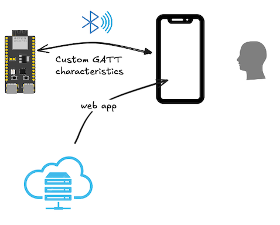

# Bluetooth Low Energy

Exposing an ESP32 device via the *Bluetooth Low Energy* protocol.

## BLE vs. Bluetooth Classic

The BLE protocol is independent of the "Bluetooth Classic" stack (which continues to co-exist with it). It is intended for **fitness**, **home automation** and **internet-of-things** use cases, i.e. anywhere where battery powered devices with non-frequent charging opportunities abound.

Some devices (like most Espressif's and all Nordic Semiconductor's) only support BLE, not the classic profiles. Likewise, some libraries (e.g. [TrouBLE](https://github.com/embassy-rs/trouble) are specific to BLE only.


## Sample case



BLE, together with *Web Bluetooth API*<sup>`[1]`</sup> allows one to make mobile user interfaces that:

- directly interface with a BLE device
- don't need any installation

This is widely beneficial for embedded systems, since the UI can be completely detached from the embedded product - and done using latest web development tools. This folder (and its sister folder for the web app) aims to show, how this can be done.

Before we advance, some points worth mentioning...

### GATT vs. L2CAP

While you don't need to master the BLE protocol, in order to make applications for it, some high level knowledge is beneficial to know *why* we do things certain way.

**GATT** is the attribute level API. BLE calls these "characteristics" - they are values one can read, write, or listen to, on another device.

**L2CAP** is a more stream-like tunnel between two devices. GATT events travel over L2CAP.

On the embedded side, one could implement custom data sources / actuators using either level of interface. However, since Web Bluetooth API only covers GATT (not L2CAP), the choice is made for us.


## Requirements

- ESP32-C6 or ESP32-C3 devkit (with [JTAG/USB cable added](https://docs.espressif.com/projects/esp-idf/en/stable/esp32c3/api-guides/usb-serial-jtag-console.html)).

   No wiring required.

### Debug tooling

Consider installing [nRF Connect for Mobile](https://play.google.com/store/apps/details?id=no.nordicsemi.android.mcp) (Google Play store), or a similar debugging tool on your mobile phone or tablet - and learning to use it.

The tool allows you to "see" the BLE environment and read/write/listen to GATT characteristics of your embedded device. It also gives you an idea, what kind of tools malicious users might try to use, to break into your data chain - i.e. it gives a nudge for building in security.

> [!NOTE]
>`Recommended Training material` section (below) covers how to learn to use this tool.


## Steps

### Build and launch the example

```
DEFMT_LOG=debug cargo build --release --features= --example custom-emb
   Compiling comms-ble v0.0.0 (/home/ubuntu/ZOO.comms/comms/ble)
    Finished `release` profile [optimized + debuginfo] target(s) in 5.52s
probe-rs run --log-format '{t:dimmed} [{L:bold}] {s}' /home/ubuntu/target/riscv32imc-unknown-none-elf/release/examples/custom-emb
      Erasing ✔ 100% [####################] 384.00 KiB @  63.41 KiB/s (took 6s)
  Programming ✔ 100% [####################] 169.39 KiB @   1.15 KiB/s (took 2m)                                                                                                   Finished in 146.69s
1.775622 [INFO ] esp-wifi configuration EspWifiConfig { rx_queue_size: 5, tx_queue_size: 3, static_rx_buf_num: 10, dynamic_rx_buf_num: 32, static_tx_buf_num: 0, dynamic_tx_buf_num: 32, csi_enable: false, ampdu_rx_enable: true, ampdu_tx_enable: true, amsdu_tx_enable: false, rx_ba_win: 6, max_burst_size: 1, country_code: "CN", country_code_operating_class: 0, mtu: 1492, tick_rate_hz: 100, listen_interval: 3, beacon_timeout: 6, ap_beacon_timeout: 300, failure_retry_cnt: 1, scan_method: 0 }
1.776713 [DEBUG] BT controller compile version aa16a46
1.778944 [DEBUG] !!!! unimplemented srand 628
1.779255 [DEBUG] The btdm_controller_init was initialized
1.890409 [INFO ] Our address = Address { kind: AddrKind(1), addr: BdAddr([0, 0, 0, 30, 131, 231]) }
1.890707 [INFO ] Starting advertising and GATT service
2.273618 [INFO ] [host] filter accept list size: 12
2.359108 [INFO ] [host] setting txq to 12
2.359182 [INFO ] [host] configuring host buffers (8 packets of size 251)
2.436892 [INFO ] [host] initialized
2.612219 [INFO ] [adv] advertising
[...]
```

That means the service is running on ESP32 and being "advertised", i.e. discoverable by clients.


### Confirm that the service is seen

Using the [nRF Connect for Mobile](https://play.google.com/store/apps/details?id=no.nordicsemi.android.mcp) tool:

- Scan the BLE neighbourhood
- you should see the device advertising itself as `"custom example"`
- `CONNECT` with it

	>

- check its services and characteristics

	>

	The icons show which characteristics you can write to (up arrow), read from (down arrow), or be notified of changes (three down arrows).
	
	>Note: Please ignore the "Unknown" titles. It simply means that the UUID's are not within the set of standardized services/characteristics of the Bluetooth specification. You cannot set them, anyways, and `nRF Connect for Mobile` could simply list them as "Custom". The UUID's are what matters.

### Observer the data (in real time)

Press the three-down-arrows (notify) icon.

>

Note that the value keeps increasing, once a second.

This could be a measurement you are observing, off the ESP32 device. It is transmitted *on demand*, the *device* making the initiative of telling the BLE stack that something has changed. It *is* cool.

### Make your mark

One of the characteristics is for steering the RGB LED on the devkit. Provide three-byte values for its red, green and blue components, to set it to different values.

<!--
*tbd. screenshots*
-->

### Logs

While that happened, the ESP32 has provided some logs, telling how it sees the events:

```
[...]
2.612219 [INFO ] [adv] advertising
222.657467 [INFO ] [adv] connection established
222.657591 [INFO ] [adv] notifying connection of change in 'magic' 1
223.687938 [INFO ] [adv] notifying connection of change in 'magic' 2
[...]
249.147878 [INFO ] [adv] notifying connection of change in 'magic' 27
250.198844 [INFO ] [adv] notifying connection of change in 'magic' 28
251.247762 [INFO ] [adv] notifying connection of change in 'magic' 29
252.178588 [ERROR] [gatt] Unknown write: 37
252.282358 [INFO ] [adv] notifying connection of change in 'magic' 30
253.303076 [INFO ] [adv] notifying connection of change in 'magic' 31
254.382750 [INFO ] [adv] notifying connection of change in 'magic' 32
[...]
```

As always, logs are there to help you debug your code.


## Next - Web client!!! 👽🚀🎰🪗🎉

As promised, we have a [Bluetooth Web API](https://developer.mozilla.org/en-US/docs/Web/API/Web_Bluetooth_API) application that makes steering the device quite a bit more intuitive!

Leave the device running and head to: [`{some URL once deployed}`](..). 

> [!WARN]
>Oh, and please use a Chrome or Edge browser. Because.. [caniuse](https://caniuse.com/web-bluetooth).

<p />

>The source for the web app is available at [`../extras/ble-web-app`](../extras/ble-web-app/README.md).


## References

- `[1]`: [Communicating with Bluetooth devices over JavaScript](https://developer.chrome.com/docs/capabilities/bluetooth) (Chrome docs)


### Training material

- Nordic Semiconductors > DevAcademy > [Bluetooth Low Energy Fundamentals](https://academy.nordicsemi.com/courses/bluetooth-low-energy-fundamentals/)

	The author took the course. Warmly recommended!!!
	
- ESP FAQ > ... > [Bluetooth LE & Bluetooth](https://docs.espressif.com/projects/esp-faq/en/latest/software-framework/bt/ble.html) (Espressif; 2025)

	66 tidbits of information - you should find one or two that are useful!
	
	C (esp-idf) based; not Rust.
