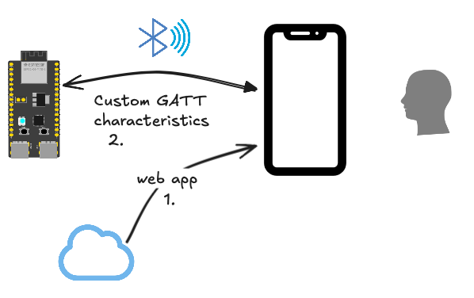
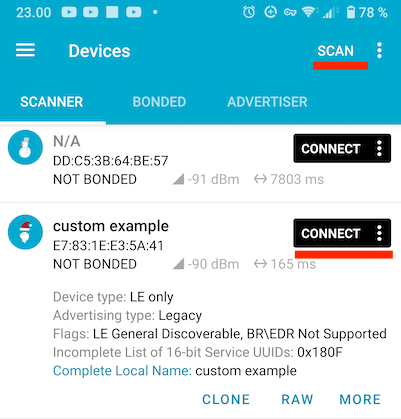
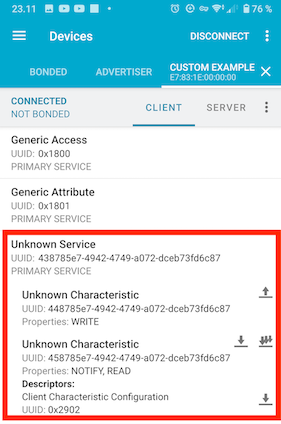
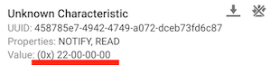

# Bluetooth Low Energy

This is a sample application, showing how to use Bluetooth Low Energy (BLE) to communicate with an embedded device

- ..securely,
- ..over protocols that the **Web Bluetooth API** can handle.



>For background of terminology and protocols, see [BACKGROUND](./BACKGROUND.md). You can do that later...

## Requirements

- ESP32-C6 or ESP32-C3 devkit

	>for ESP32-C3 devkit, [a JTAG/USB cable](https://docs.espressif.com/projects/esp-idf/en/stable/esp32c3/api-guides/usb-serial-jtag-console.html) must be connected

No wiring is required.


### Bluetooth sniffer (recommended)

Consider installing [nRF Connect for Mobile](https://play.google.com/store/apps/details?id=no.nordicsemi.android.mcp) (Google Play store<sup>`|1|`</sup>) on your mobile phone or tablet - and learning to use it.

The tool allows you to "see" the BLE environment and read/write/listen to GATT characteristics of your embedded device. We use it here for manually testing that the service functions.

>Using the tool also gives you an idea, what kind of tools malicious users might try to use - i.e. it gives a nudge for building in security.

<small>
`|1|`: ; available also on [App Store](https://apps.apple.com/fi/app/nrf-connect-for-mobile/id1054362403) (iOS) and as [nRF Connect for Desktop](https://www.nordicsemi.com/Products/Development-tools/nRF-Connect-for-Desktop) (Win64/Linux/macOS). The desktop tool requires an external [dongle](https://www.nordicsemi.com/Products/Development-hardware/nRF52840-Dongle) or other, compatible device.
</small>


## Steps

### Connect your devkit

```
$ probe-rs list
The following debug probes were found:
[0]: ESP JTAG -- 303a:1001:54:32:04:44:74:C0 (EspJtag)
```

### Build and launch the example

```
DEFMT_LOG=esp_hal=info,esp_rtos=info,debug cargo run --release --features=defmt --example custom-emb
   Compiling comms-ble v0.0.0 (/home/ubuntu/ZOO.comms/comms/ble)
[...compiling...]
[...flashing...]
[...]
0.429083 [DEBUG] The btdm_controller_init was initialized  esp_radio ble/btdm.rs:354
0.464081 [DEBUG] Our address = [54, 32, 04, 44, 74, c0]  custom_emb custom-emb/main.rs:112
0.464571 [DEBUG] Starting GATT server  custom_emb custom-emb/gatt_server.rs:34
0.467825 [DEBUG] Starting advertising  custom_emb custom-emb/gatt_server.rs:44
0.474291 [INFO ] [host] using packet pool with MTU 255 capacity 16  trouble_host src/host.rs:1098
0.475860 [INFO ] [host] filter accept list size: 12  trouble_host src/host.rs:1105
0.477435 [INFO ] [host] setting txq to 12, fragmenting at 251  trouble_host src/host.rs:1108
0.477531 [INFO ] [host] configuring host buffers (1 packets of size 255)  trouble_host src/host.rs:1117
0.479128 [INFO ] [host] initialized  trouble_host src/host.rs:1136
0.481404 [INFO ] [host] Device Address 56:32:04:44:74:C1  trouble_host src/host.rs:1144
0.552621 [INFO ] [adv] advertising  custom_emb custom-emb/gatt_server.rs:108
[...]
```

That means the service is running and being "advertised", i.e. discoverable by clients.

Let's have a look!!!


## Test

### Confirm that the service is seen

Using the [nRF Connect for Mobile](https://play.google.com/store/apps/details?id=no.nordicsemi.android.mcp) tool:

- Scan the BLE neighbourhood
- you should see the device advertising itself as `"custom example"`
- `CONNECT` with it.

	>

	If the tool asks you to *pair* with `"custom example"`, please do. Pairing enables encryption of the connection.

- check its services and characteristics

	>

	The icons show which characteristics you can write to (up arrow), read from (down arrow), or be notified of changes (three down arrows).
	
	Please ignore the "Unknown" titles. It simply means that the UUID's are not within the set of standardized services/characteristics of the Bluetooth specification. The `nRF Connect for Mobile` could simply list them as "Custom". The UUID's are what matters.

### Observe the data (in real time)

Press the three-down-arrows (notify) icon.

>

Note that the value keeps increasing, once a second.

>[!NOTE]
>This part may be broken, at the moment. The folder is 🚧🚧🚧.

This could be any measurement you are observing, off the device. It is transmitted *on demand*, the *device* making the initiative of telling the BLE stack that something has changed. It *is* cool.

<!--R
### Show your color

One of the characteristics is for steering the RGB LED on the devkit. Provide three-byte values for its red, green and blue components, to set it to different values.

*tbd. image*
-->

### Logs

While that happened, the ESP32 has provided some logs, telling us how it sees the events:

```
[...]
2.612219 [INFO ] [adv] advertising
136.892235 [DEBUG] [host] connection with handle ConnHandle(1) established to BdAddr([29, 51, a4, a8, 10, 64])  trouble_host src/host.rs:260
136.892694 [DEBUG] [link][poll_accept] connection accepted: state: state = Connected, conn = Some(ConnHandle(1)), flow = 12, role = Some(Peripheral), peer = Some(BdAddr(BdAddr([29, 51, A4, A8, 10, 64])) Irk(None)), ref = 0, sar = PacketReassembly { state: None }  trouble_host src/connection_manager.rs:360
136.893076 [INFO ] [adv] connection established  custom_emb custom-emb/gatt_server.rs:112
137.410649 [DEBUG] exchange_att_mtu: 527, current default: 251  trouble_host src/connection_manager.rs:502
137.410874 [INFO ] [host] agreed att MTU of 251  trouble_host src/host.rs:460
137.560797 [INFO ] [smp] Pairing method JustWorks  trouble_host pairing/peripheral.rs:381
141.972660 [INFO ] [smp] Just works pairing with compare 265089  trouble_host pairing/peripheral.rs:548
142.034518 [INFO ] Enabling encryption for BdAddr(BdAddr([29, 51, A4, A8, 10, 64])) Irk(None)  trouble_host security_manager/mod.rs:759
142.210628 [INFO ] Link encrypted!  trouble_host pairing/peripheral.rs:205
142.211363 [DEBUG] [gatt] pairing complete: Encrypted  custom_emb custom-emb/gatt_server.rs:136
142.271372 [WARN ] [gatt] unknown error)  custom_emb custom-emb/gatt_server.rs:158
142.331041 [WARN ] [gatt] unknown error)  custom_emb custom-emb/gatt_server.rs:158
[...]
260.591265 [WARN ] [gatt] unknown error)  custom_emb custom-emb/gatt_server.rs:158
262.541254 [WARN ] [gatt] unknown error)  custom_emb custom-emb/gatt_server.rs:158
390.731217 [DEBUG] [gatt] reading 'bb.pressed': Ok(false)  custom_emb custom-emb/gatt_server.rs:151
394.871098 [DEBUG] [gatt] reading 'bb.pressed': Ok(false)  custom_emb custom-emb/gatt_server.rs:151
396.761114 [DEBUG] [gatt] reading 'bb.pressed': Ok(false)  custom_emb custom-emb/gatt_server.rs:151
400.661040 [WARN ] [gatt] unknown error)  custom_emb custom-emb/gatt_server.rs:158
402.281037 [WARN ] [gatt] unknown error)  custom_emb custom-emb/gatt_server.rs:158
[...]
```

As always, logs are there to help you debug your code.


## Web client!!! 👽🚀🎰🪗🎉

As promised, we have a [web application](https://...tbd...) <sup>`|2|`</sup> that makes steering the device quite a bit more intuitive!

<!-- tbd. image of the web app

have the image be a link to it.
-->

Leave the device running and open the link.

>[!WARN]
>Oh, and please use a Chrome or Edge browser. Because.. [Safari is firmly on red](https://caniuse.com/web-bluetooth).

The web application you are using is just a static web page. There is no server, no sign-up. All communication happens directly between the BLE devices, "offline" from the Internet's point of view.

<small>
`|2|`: The source for the web app is available at: [ZOO-BLE-webapp](http://github.com/finalyards/ZOO-BLE-webapp).
</small>


# Learning

The Bluetooth Low Energy ecosystem is more complex than normal sensors would be. Thus, we want to offer a list of in-depth documents to the protocols.

- [Introduction to Bluetooth Low Energy](https://learn.adafruit.com/introduction-to-bluetooth-low-energy?view=all) (Adafruit; published Mar'14, updated Jun'25)

	Simple introduction (maybe 5-10 min).

	>Note: The text has *some* inaccuracies, for example a Bluetooth Peripheral can be in connection with multiple Centrals, at the same time.
	
	<!-- Editor's note
	Is the above note correct, or the Adafruit doc? Does GATT enforce 1-to-1 between peripherals and centrals, or
	is it just a convention that Adafruit writes out as a rule? #help
	-->

- [Bluetooth Low Energy Fundamentals](https://academy.nordicsemi.com/courses/bluetooth-low-energy-fundamentals/) (DevAcademy by Nordic Semiconductor)

	- 6 lessons
	- "8–10 hours to complete"
	- Exercises use Nordic hardware, but can also just be read through.

	Author's opinion: <u>*If you only plan to attend one course, this is a good one!*</u>

You will be "living" on the "host" side of the HCI (Host/Client Interface). Most BLE devices (ESP32 included) have such an interface, even when the same chip would handle both roles. The interface is standardized, essentially "just" meaning serializing/deserializing anythnig that goes in or out the BLE core (called "client"). The [trou-ble](https://github.com/embassy-rs/trouble) library takes care of this for you, but it's good to know what's under the hood...


## References

- [Bluetooth Classic & BLE with ESP32](https://dronebotworkshop.com/esp32-bluetooth/) (DroneBot Workshop; May 2024)	<!-- date based on associated Youtube video's timestamp -->
	
<!-- #hidden; messy	
- [Bluetooth LE & Bluetooth](https://docs.espressif.com/projects/esp-faq/en/latest/software-framework/bt/ble.html) (Espressif; 2025)

	- 66 tidbits of information - you should find one or two that are useful!
	- "C" (esp-idf) based; not Rust.
	- be aware when "ESP32" (the chip) is referred to, instead of ESP32 (the family!)
-->

- [Part A. Data Types Specification](https://www.bluetooth.com/wp-content/uploads/Files/Specification/HTML/CSS_v11/out/en/supplement-to-the-bluetooth-core-specification/data-types-specification.html) (Bluetooth.com; very official)

	Look up here for using the right terms.

- [Trouble documentation](https://embassy.dev/trouble/)

	A book about the library; the source for its Cargo features.
