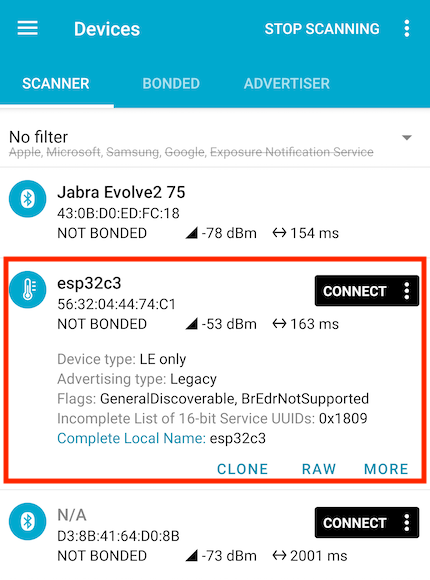

# Bluetooth Low Energy

Exposing an ESP32 device via the [Bluetooth Low Energy](https://learn.adafruit.com/introduction-to-bluetooth-low-energy/introduction) (Adafruit) protocol.

**Background**

The BLE protocol is completely separate from "Bluetooth Classic" (which can co-exists with it). The "LE" protocol allows the radio to be switched on and off, saving power.

## Requirements

An ESP32-C6 or ESP32-C3 devkit (with [JTAG-USB cable added](https://docs.espressif.com/projects/esp-idf/en/stable/esp32c3/api-guides/usb-serial-jtag-console.html) for C3).

Test this by:

```
$ probe-rs list
The following debug probes were found:
[0]: ESP JTAG -- 303a:1001:54:32:04:07:15:10 (EspJtag)
```

No wiring is needed. 


## Running

### Launching the Bluetooth device

```
$ DEFMT_LOG=debug cargo run --release --example x-emb
[...]
0.793924 [INFO ] esp-wifi configuration EspWifiConfig { rx_queue_size: 5, tx_queue_size: 3, static_rx_buf_num: 10, dynamic_rx_buf_num: 32, static_tx_buf_num: 0, dynamic_tx_buf_num: 32, csi_enable: false, ampdu_rx_enable: true, ampdu_tx_enable: true, amsdu_tx_enable: false, rx_ba_win: 6, max_burst_size: 1, country_code: "CN", country_code_operating_class: 0, mtu: 1492, tick_rate_hz: 100, listen_interval: 3, beacon_timeout: 6, ap_beacon_timeout: 300, failure_retry_cnt: 1, scan_method: 0 }
0.853086 [DEBUG] The ble_controller_init was initialized
0.853120 [INFO ] Connector created
0.857462 [INFO ] ble_npl_eventq_remove 0x4080c08c 0x4080e730
0.877252 [INFO ] "Ok(CommandComplete { num_packets: 1, opcode: 3075, data: [0] })"
0.887373 [INFO ] "Ok(CommandComplete { num_packets: 1, opcode: 8198, data: [0] })"
0.907548 [INFO ] "Ok(CommandComplete { num_packets: 1, opcode: 8200, data: [0] })"
0.918109 [INFO ] "Ok(CommandComplete { num_packets: 1, opcode: 8202, data: [0] })"
0.918306 [INFO ] started advertising
```

### Confirm that the service is seen (optional)

You can now use a Bluetooth development tool such as [nRF Connect for Mobile](https://play.google.com/store/apps/details?id=no.nordicsemi.android.mcp) (Google Play Store), to:

- confirm that a device named "`esp32c{3|6}`" is advertising itself
- `CONNECT` to it
- check its services and characteristics

>

*Figure. Screenshot of the `nRF Connect for Mobile` Android app*

>**Exercise**
>
>If you are using the above tool, do this:
>- `Connect`
> 	- Tap `Unknown Service` to reveal the characteristics
>		- You can now read and write those (the DOWN/UP arrows)
>
>You can also walk away from the device, with the phone, and see how far its range reaches.
>
>In addition, you can log data:
>
>```
>156.678779 [INFO ] RECEIVED: 0 [72, 105, 32, 116, 111, 32, 121, 111, 117]
>192.729017 [INFO ] RECEIVED: 0 [72, 105, 32, 97, 103, 97, 105, 110, 33]
>```


## Next episode - Web 

Head over to [`../extras/ble-web-app`](../extras/ble-web-app/README.md) and you'll find a Web app that can interact with your BLE device!

Leave the device on. See you there! :)

