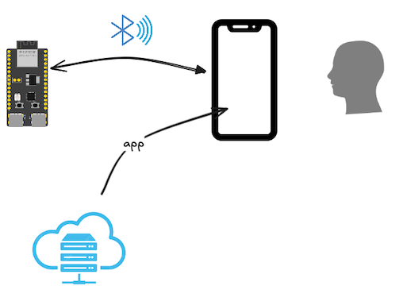

# Bluetooth Low Energy

Exposing an ESP32 device via the *Bluetooth Low Energy* protocol.

**Background**

The BLE protocol is independent of the "Classic" Bluetooth stack (which continues to co-exist with it). Some devices (like ESP32's and all Nordic Semiconductor's only support BLE, not the classic profiles).

The "LE" stack is intended for **fitness**, **home automation** and **internet-of-things** use cases, i.e. anywhere where battery powered devices with non-frequent charging opportunities abound.

>With the advent of BLE 6 (not supported by ESP32 chips, yet; 2024), also home audio enters the application domain, via Bluetooth LE Audio.

## Sample case



*Figure 1. Interacting with an embedded device, using a web app.*

Collecting information and/or controlling a device, via Bluetooth, off a web application. This allows a mobile phone user to wirelessly, and without installing a native application, to work with an embedded product.

Since we control the ESP32 side of things, we can freely affect what kind of Bluetooth profile is used for the link.

## Requirements

An ESP32-C6 or ESP32-C3 devkit (with [JTAG-USB cable added](https://docs.espressif.com/projects/esp-idf/en/stable/esp32c3/api-guides/usb-serial-jtag-console.html) for C3). No wiring required.

Test this by:

```
$ probe-rs list
The following debug probes were found:
[0]: ESP JTAG -- 303a:1001:54:32:04:07:15:10 (EspJtag)
```

### Debug tooling

Consider installing [nRF Connect for Mobile](https://play.google.com/store/apps/details?id=no.nordicsemi.android.mcp) (Google Play store), or a similar debugging tool on your mobile phone or tablet - and learning to use it.

>The Nordic Semiconductor training material mentioned in the `Recommended Training material` section covers this tool.


## Running the example

<!-- tbd. UPDATE so this is all on the custom -->

### Launching the Bluetooth device

```
$ DEFMT_LOG=debug cargo run --release --example custom-emb
   Compiling comms-ble v0.0.0 (/home/ubuntu/ZOO.comms/comms/ble)
    Finished `release` profile [optimized + debuginfo] target(s) in 8.39s
probe-rs run --log-format '{t:dimmed} [{L:bold}] {s}' /home/ubuntu/target/riscv32imc-unknown-none-elf/release/examples/trouble-emb
      Erasing ✔ 100% [####################] 384.00 KiB @  76.86 KiB/s (took 5s)
  Programming ✔ 100% [####################] 166.78 KiB @   1.46 KiB/s (took 2m)                                                                                                   Finished in 113.91s
<time> [INFO ] esp-wifi configuration EspWifiConfig { rx_queue_size: 5, tx_queue_size: 3, static_rx_buf_num: 10, dynamic_rx_buf_num: 32, static_tx_buf_num: 0, dynamic_tx_buf_num: 32, csi_enable: false, ampdu_rx_enable: true, ampdu_tx_enable: true, amsdu_tx_enable: false, rx_ba_win: 6, max_burst_size: 1, country_code: "CN", country_code_operating_class: 0, mtu: 1492, tick_rate_hz: 100, listen_interval: 3, beacon_timeout: 6, ap_beacon_timeout: 300, failure_retry_cnt: 1, scan_method: 0 }
<time> [DEBUG] BT controller compile version aa16a46
<time> [DEBUG] !!!! unimplemented srand 82
<time> [DEBUG] The btdm_controller_init was initialized
<time> [INFO ] Our address = Address { kind: AddrKind(1), addr: BdAddr([65, 90, 227, 30, 131, 231]) }
<time> [INFO ] Starting advertising and GATT service
<time> [INFO ] [host] filter accept list size: 12
<time> [INFO ] [host] setting txq to 12
<time> [INFO ] [host] configuring host buffers (8 packets of size 251)
<time> [INFO ] [host] initialized
<time> [INFO ] [adv] advertising
```

### Confirm that the service is seen (optional)

Using a Bluetooth development tool such as [nRF Connect for Mobile](https://play.google.com/store/apps/details?id=no.nordicsemi.android.mcp) (Google Play Store):

- confirm that the device is advertising itself as "`bas example`"
- `CONNECT` to it
- check its services and characteristics

>

<font color=red>*tbd. renew the screenshot*</font>
*Screenshot of the `nRF Connect for Mobile` Android app*

>**Exercise**
>
>If you are using the above tool, do this:
>
>- `Connect`
> 	- Tap `Generic Access` > `Device Name` > `⤓` (load)
>  		- Check the `Value` now shows `TrouBLE`
> 	- Tap `Battery Service` > `Battery Level` > `⤓` (notify)
> 		- Notice that `Notifications enabled` is shown and the (simulated) battery charging level starts increasing. ((It does increase past 100%; heh)
>
>In addition, note that the device logs show:
>
>```
>[...]
>294.890915 [INFO ] [adv] notifying connection of tick 69
>296.904956 [INFO ] [adv] notifying connection of tick 70
>298.923065 [INFO ] [adv] notifying connection of tick 71
>299.004378 [INFO ] [gatt] Write event on battery level characteristic: [0, 0]
>299.004975 [INFO ] [gatt] Write Event to Level Characteristic: Ok(71)
>300.957732 [INFO ] [adv] notifying connection of tick 72
>302.978011 [INFO ] [adv] notifying connection of tick 73
>305.073700 [INFO ] [adv] notifying connection of tick 74
>307.094089 [INFO ] [adv] notifying connection of tick 75
>[...]
>```

The service emulates a battery level indicator, and is a standard BLE profile. What's more interesting (to this author, at least) is making *custom* profiles.

Let's run such, next!

---

[>> Readme section 2: Custom BLE service](./STEP_2.md)

