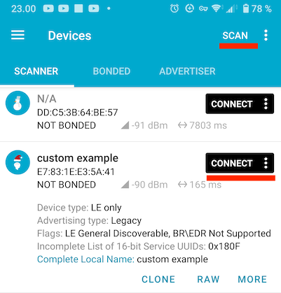
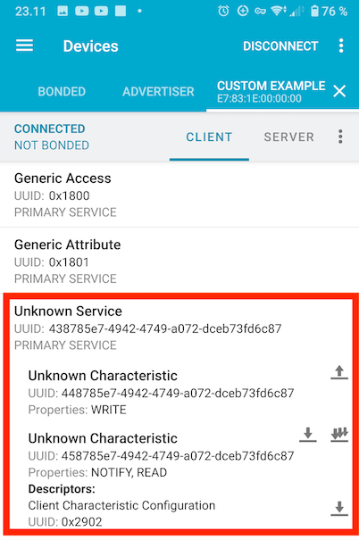

# Bluetooth Low Energy

Exposing an ESP32 device via the *Bluetooth Low Energy* protocol.

## Some background

The BLE protocol is independent of the "Classic" Bluetooth stack (which continues to co-exist with it). Some devices (like ESP32's and all Nordic Semiconductor's only support BLE, not the classic profiles).

The "LE" stack is intended for **fitness**, **home automation** and **internet-of-things** use cases, i.e. anywhere where battery powered devices with non-frequent charging opportunities abound.

<!-- #whisper
>With the advent of BLE 6 (not supported by ESP32 chips, yet; 2024), also home audio enters the application domain, via Bluetooth LE Audio.
-->

## Sample case


*Figure 1. Interacting with an embedded device, using a web app.*

Collecting information and/or controlling a device, via Bluetooth, off a web application. This allows a mobile phone user to wirelessly, and without installing any applications, to work with an embedded product.

Since we control the ESP32 side of things, we can freely affect what kind of Bluetooth profile is used for the link.

## Requirements

An ESP32-C6 or ESP32-C3 devkit ([JTAG-USB cable added](https://docs.espressif.com/projects/esp-idf/en/stable/esp32c3/api-guides/usb-serial-jtag-console.html) for C3). No wiring required.

Test this by:

```
$ probe-rs list
The following debug probes were found:
[0]: ESP JTAG -- 303a:1001:54:32:04:07:15:10 (EspJtag)
```

### Debug tooling

Consider installing [nRF Connect for Mobile](https://play.google.com/store/apps/details?id=no.nordicsemi.android.mcp) (Google Play store), or a similar debugging tool on your mobile phone or tablet - and learning to use it.

>The Nordic Semiconductor training material mentioned in the `Recommended Training material` section covers this tool.


## Running an example


### Launching the Bluetooth device

```
DEFMT_LOG=debug cargo build --release --features= --example custom-emb
   Compiling comms-ble v0.0.0 (/home/ubuntu/ZOO.comms/comms/ble)
    Finished `release` profile [optimized + debuginfo] target(s) in 5.52s
probe-rs run --log-format '{t:dimmed} [{L:bold}] {s}' /home/ubuntu/target/riscv32imc-unknown-none-elf/release/examples/custom-emb
      Erasing ✔ 100% [####################] 384.00 KiB @  63.41 KiB/s (took 6s)
  Programming ✔ 100% [####################] 169.39 KiB @   1.15 KiB/s (took 2m)                                                                                                   Finished in 146.69s
1.775622 [INFO ] esp-wifi configuration EspWifiConfig { rx_queue_size: 5, tx_queue_size: 3, static_rx_buf_num: 10, dynamic_rx_buf_num: 32, static_tx_buf_num: 0, dynamic_tx_buf_num: 32, csi_enable: false, ampdu_rx_enable: true, ampdu_tx_enable: true, amsdu_tx_enable: false, rx_ba_win: 6, max_burst_size: 1, country_code: "CN", country_code_operating_class: 0, mtu: 1492, tick_rate_hz: 100, listen_interval: 3, beacon_timeout: 6, ap_beacon_timeout: 300, failure_retry_cnt: 1, scan_method: 0 }
1.776713 [DEBUG] BT controller compile version aa16a46
1.778944 [DEBUG] !!!! unimplemented srand 628
1.779255 [DEBUG] The btdm_controller_init was initialized
1.890409 [INFO ] Our address = Address { kind: AddrKind(1), addr: BdAddr([0, 0, 0, 30, 131, 231]) }
1.890707 [INFO ] Starting advertising and GATT service
2.273618 [INFO ] [host] filter accept list size: 12
2.359108 [INFO ] [host] setting txq to 12
2.359182 [INFO ] [host] configuring host buffers (8 packets of size 251)
2.436892 [INFO ] [host] initialized
2.612219 [INFO ] [adv] advertising
[...]
```

That means the service is running on ESP32 and being "advertised", i.e. discoverable by clients.


### Confirm that the service is seen

Using a Bluetooth development tool such as [nRF Connect for Mobile](https://play.google.com/store/apps/details?id=no.nordicsemi.android.mcp) (Google Play Store):

- Scan the BLE neighbourhood
- you should see the device advertising itself as `"custom example"`
- `CONNECT` with it

	>

- check its services and characteristics

	>

	The icons show which characteristics you can write to, read, or observe (be notified).
	
	>Note: Ignore the "Unknown" in the titles. It simply means that the UUID's are not within the set of standardized services/characteristics of the Bluetooth specification. You cannot set titles, anyways, and `nRF Connect for Mobile` could list them as "Custom". 

Press the three-down-arrows (notify) icon.

>

Note that the value keeps increasing, once a second.

>This could be a measurement you are observing, off the ESP32 device. :)


### The log

While this has happened, the ESP32 has provided some logs, telling how it sees the events:

```
[...]
2.612219 [INFO ] [adv] advertising
222.657467 [INFO ] [adv] connection established
222.657591 [INFO ] [adv] notifying connection of change in 'magic' 1
223.687938 [INFO ] [adv] notifying connection of change in 'magic' 2
[...]
249.147878 [INFO ] [adv] notifying connection of change in 'magic' 27
250.198844 [INFO ] [adv] notifying connection of change in 'magic' 28
251.247762 [INFO ] [adv] notifying connection of change in 'magic' 29
252.178588 [ERROR] [gatt] Unknown write: 37
252.282358 [INFO ] [adv] notifying connection of change in 'magic' 30
253.303076 [INFO ] [adv] notifying connection of change in 'magic' 31
254.382750 [INFO ] [adv] notifying connection of change in 'magic' 32
[...]
```

>The author does not know what the "Unknown write: 37" is.

As always, logs are there to help you debug your code.

## Next - Web client!!! 👽🚀🎰🪗🎉

There is a thing called [Bluetooth Web API](https://developer.mozilla.org/en-US/docs/Web/API/Web_Bluetooth_API) (that basically is just a BLE API). It allows you to control *both sides* of the data exchange, by creating your own custom "application" (a web app) that can connect to, read and control your embedded product.

Now. **How cool is that!**

Leave the BLE service running (you can even keep your phone/tablet connected to it) and head to: [`{some URL once deployed}`](..). <!-- tbd.
 -->

>Oh, and please use a Chrome or Edge browser. [caniuse](https://caniuse.com/web-bluetooth)

<p />

>The source for the web app is available at [`../extras/ble-web-app`](../extras/ble-web-app/README.md).
