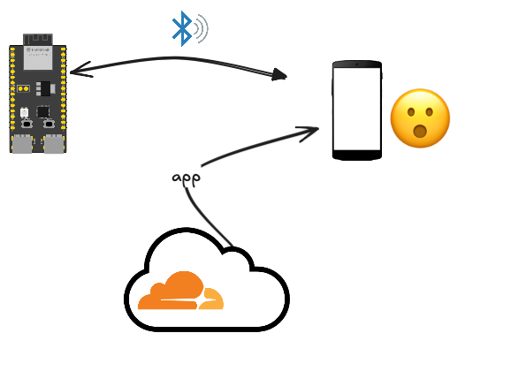

# `ble-web-app`

A web application for interacting with a nearby Bluetooth device, advertising a custom service.

Like... the one in [`../ble/examples/custom-emb.rs`](../ble/examples/custom-emb.rs). 

## Small preface

"Bluetooth Web API" (which we'll use) really is a BLE API. It doesn't cover the "classic" side of Bluetooth and we are really, really fine by this (also the Nordic Semiconductor and ESP32 MCUs only provide BLE, not classic Bluetooth).

<details><summary>So.. why didn't they call it BLE Web API?</summary>
That choice BLEW! 💥
></details>

## Requirements

- `node.js` 
- `npm`
- `wrangler` (optional)

	>If you wish a ready package for these, see `mp` > [`web+cf`](https://github.com/akauppi/mp/tree/main/web+cf) (GitHub).

## Pre-read (optional)

- [How To Use The Web Bluetooth API](https://confidence.sh/blog/how-to-use-the-web-bluetooth-api/) (blog; Jan'24)

	`Megaconfidence`'s write is really concise, diving right into the API without needing *any frameworks* - bare HTML, CSS and JS. 
	
	The author claims it would work with the wrist watch you are wearing!! (but this author failed to see his listed).

	>Hint: Complete repo is at [megaconfidence/bt-heart-monitor](https://github.com/megaconfidence/bt-heart-monitor).

## Steps

```
$ npm install
```

That installs the dependencies.

```
$ npm run dev
[...]
Forced re-optimization of dependencies

  VITE v5.4.11  ready in 27092 ms

  ➜  Local:   http://localhost:5173/
  ➜  Network: use --host to expose
  ➜  press h + enter to show help
```

If you are using Multipass for virtualization, that `localhost` is within your VM, unreachable. Either:

**A. Use your VM's IP**

```
[host]$ mp info {vm-name}
[...]
IPv4:           192.168.64.149
[...]
```

With that IP, open [`http://192.168.64.149:5173`](http://192.168.64.149:5173).

This approach is easier, but you need to remember to use the VM's IP. Also, the IP is bound to change at times.


**B. Port forward**

This approach makes the port `5173` usable - as `localhost:5173` - from your host. However, it requires you to:

- run `sudo` on the host
- leave a window open for the duration of the port forward

Follow the instructions [within the `mp` repo](https://github.com/akauppi/mp/tree/main/web#using-installing-a-cli):

```
$ sudo ssh -i /var/root/Library/Application\ Support/multipassd/ssh-keys/id_rsa -L 5173:localhost:5173 ubuntu@192.168.64.149

# keep the terminal open
```

Open [`localhost:5173`](http://localhost:5173).


## Deployment (optional)

The application is made with deployment to Cloudflare Pages in mind, but you can easily change the SvelteKit adapter to your choosing.

### Access rights

Follow the steps [here](https://github.com/akauppi/mp/tree/main/web%2Bcf#b-login-with-custom-api-tokens).

- Create an API token for this application

	- Set the access rights mentioned on the above linked page<br />
	+ `Users` > `Memberships` > `Read`

- export it as `CLOUDFLARE_API_TOKEN` env.var.

```
$ wrangler whoami

 ⛅️ wrangler 3.87.0 (update available 3.88.0)
-------------------------------------------------------

Getting User settings...
ℹ️  The API Token is read from the CLOUDFLARE_API_TOKEN in your environment.
👋 You are logged in with an API Token, associated with the email demo@outstanding.earth.
┌───────────────────┬─────────────────────────────┐
│ Account Name      │ Account ID                  │
├───────────────────┼─────────────────────────────┤
│ Outstanding Earth │ ...8<8<8< snipped 8<8<8<... │
└───────────────────┴─────────────────────────────┘
```

### Deploy manually

```
$ npm run deploy

> ble-web-app@0.0.1 deploy
> npm run build && wrangler pages deploy


> ble-web-app@0.0.1 build
> vite build

vite v5.4.11 building SSR bundle for production...
✓ 144 modules transformed.
vite v5.4.11 building for production...
✓ 121 modules transformed.
.svelte-kit/output/client/_app/version.json                                    0.03 kB │ gzip:  0.04 kB
.svelte-kit/output/client/.vite/manifest.json                                  2.79 kB │ gzip:  0.52 kB
.svelte-kit/output/client/_app/immutable/chunks/legacy.B5bMJODb.js             0.04 kB │ gzip:  0.06 kB
[...]
✓ built in 4.11s
.svelte-kit/output/server/.vite/manifest.json                  1.65 kB
[...]
✓ built in 32.79s

Run npm run preview to preview your production build locally.

> Using @sveltejs/adapter-cloudflare
  ✔ done
? The project you specified does not exist: "ble-web-app". Would you like to create it? › - Use arrow-keys. Return to submit.
❯   Create a new project
[...answer some prompts...]

✨ Successfully created the 'ble-web-app' project.
✨ Success! Uploaded 15 files (2.87 sec)

✨ Uploading _headers
✨ Compiled Worker successfully
✨ Uploading Worker bundle
✨ Uploading _routes.json
🌎 Deploying...
✨ Deployment complete! Take a peek over at https://b66fc1e5.ble-web-app.pages.dev
```

Great!!!

The URL you get is for the particular deployment.

If you don't need to share these things, nothing prevents you from just copy-pasting that and using it as such.

>macOS hint:
>
>Cmd-double-click on such a URL. :)


## What this means



We can now browse to a website

..that provides a UI

..that can find and control a BLE device in our proximity!


### ..for security

For demo purposes, you can leave the web app unprotected (if there are no secrets in its content itself). In order for anyone to steer the device, they need to <u>both know the URL and be in the proximity of such a device</u>.

If there should be access restrictions, the same authentication mechanisms that you'd use for any web page can be applied (password, social login, corporate login).

## ..for security (take 2!)

But what about the BLE security? Forget about the web page - if the BLE interface is unprotected, people can just use a suitable monitoring software and steer your device.

True.

For pairing, you can require certain numbers to be entered. You can likely hide the device. But this is something the author is only approaching. Browsing the web, you'll likely get answers (after all, BLE is already 14 years old!) - and ideally, you'd write something about it *right here*. :)


## References

- [Communicating with Bluetooth devices over JavaScript](https://developer.chrome.com/docs/capabilities/bluetooth) (blog-like doc; "Last updated 2015-07-21")

	>Note the date

- ["Bluetooth Web API Guide Based on Our Experience With BLE Device Connection"](https://stormotion.io/blog/web-ble-implementation/) (Stormotion, Jul'24)

- [Web Bluetooth](https://webbluetoothcg.github.io/web-bluetooth) (spec draft, last edit Oct'24)

	Mostly on how to implement a User Agent (in a browser); security and such. Can be an interesting read, though. Though it's marked as "Oct'24", some references within the text itself date from 2014.

<!-- #LeaveOut, since:
>>Not /quite/ good enough for us... Verbose, and some opinions are a bit shaky ("limited range" as a con, when it can also be seen as a pro, and frankly... it's relative to what your aims are!!

- [Bluetooth Web API Guide Based on Our Experience With BLE Device Connection](https://stormotion.io/blog/web-ble-implementation/) (article, Jul'24)
-->

<!-- #LeftOut, since
	- aging
	- no search!
	- not needed to understand Bluetooth Web API!

- [Web Bluetooth specification](https://webbluetoothcg.github.io/web-bluetooth/) (GitHub, dated Nov'24 but... seems aging)

	Written mostly to the implementors of Web Bluetooth (i.e. browser authors), it's still an interesting read if you have the time...

	>While the beginning mentions 2024, the text itself covers Bluetooth 4..4.2, not Bluetooth 5 (which was released ~2019 and carries improvements to BLE, thus essential for Bluetooth Web API). Strange.

	<span />
	
	>Also, while being from W3C (at least a working group), the site doesn't sport a search field. Great omission! Don't like it... at all.
-->	
	
