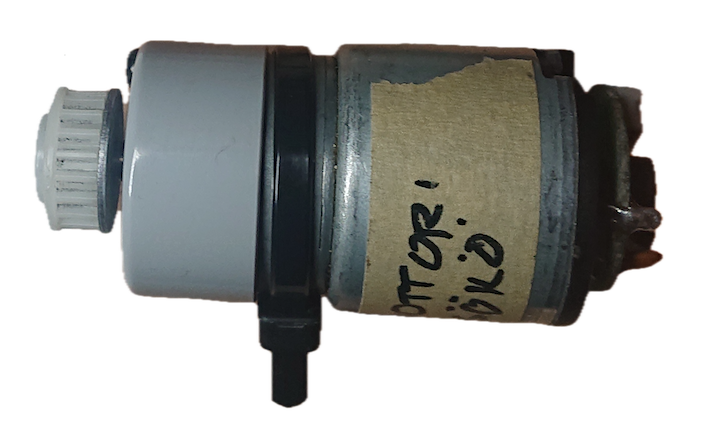
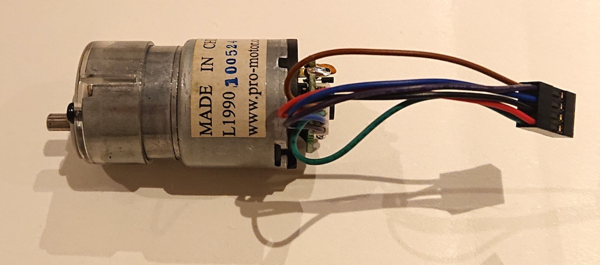
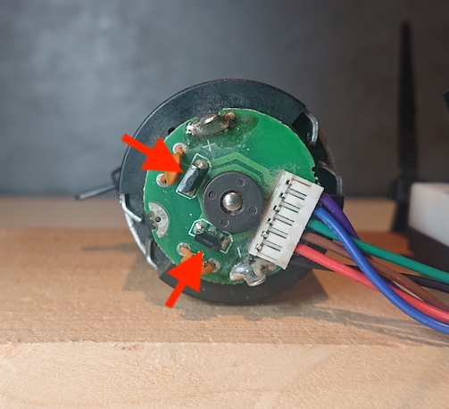
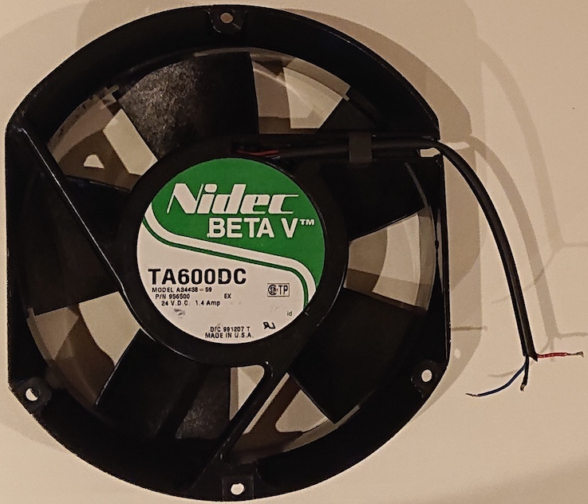

# DC motors

>The controller we use is covered in its own section: [`drv8871`](./drv8871/README.md).

In this collection level of DC motors, let's look at the two motors and power sources the author used for experimenting.

You can use pretty much any DC motor, and any power source, starting from a 9V battery. Let's go!


## Motors

Here are the two samples the author has access to:

### Salvaged vacuum robot motor



<!--

-->
This is a traditional DC motor with an integrated reduction gear.

|||
|---|---|
|voltage range|*unknown*; 2.6..15V (tried out)|
|current intake|0.17..0.2A (tried out)|

The pinout for the wires:

```
.------.-----.-----.-----.
|M1 🔴 |M2 ⚫️|H2 🔵|H1 🟣|
|GND 🟢|     |     |+5V 🟤|
`------'-----'-----'------´

M1, M2: power to the motor
H1, H2: Hall sensors (input)
GND, +5V: for powering the sensor board
```

One can run the motor directly from its `+`/`-` pins, bypassing the cable, or via the integrated circuit board. When using the circuit board, we have access to two hall sensors, arranged in a 90° orientation.



**Observations**

We can run the motor with 2.6..15V voltages (perhaps even up to 18V; did not try). The current intake is a steady 0.17..0.18 A without load. By causing friction by a thumb, it raises to 0.2 A.

We only need one of the hall sensors to detect speed of the motor (two are likely for detecting precise orientation).

The motor is intended for slow robot movements (a vacuum); good for developing software but not useful for the end goal the author has in mind (more on brushless motors on that)..


### A fan: Nidec BETA V TA600DC (24V; 1.4A)



|||
|---|---|
|voltage|24V (label); 12.8..22V (tried out)|
|current intake|1.4A (label); 1..1.6A (tried out)|
|manufacturer|[Nidec](https://www.nidec.com/en/)|
|data sheet|via e.g. [this page](https://www.elecok.com/nidec-ta600dc-a34438-59-24v-1-4a-3wires-cooling-fan.html)|

This is a pretty powerful fan. It starts rotating around 12.8V (1A) and rotates ever faster when voltage is increased. Without having it properly mounted, didn't even want to try with 24V.

There is one hall effect input (blue cable).

**Observations**

*tbd. What waveform (voltage) and frequencies on the hall effect cable?*


## Power source(s)

You can use "any" power source, starting from a 9V battery (for small motors).

When you experiment with a new motor, attaching it directly to a variable voltage source<sup>`[1]`</sup> is the way to go.

When installing the motor, you'd use a constant DC source and steer the speed via PWM and a motor controller. E.g. the fan could be run with 24V input (or lower) and necessary speeds be reached via PWM, without altering the actual (peak) voltage.

<small>`[1]`: *The author uses a Jesverty Laboratory Power Supply [from Amazon](https://www.amazon.de/dp/B0B8S6CH3H) and is generally pleased with it.*</small>


## Motor controller

A motor controller is a fairly simple circuit that keeps your logic voltage separate from the (higher) voltage fed to the motor(s). It also allows the speed of the motor be controlled via (logic side) PWM inputs.

The example we've selected is discussed under:

- [`drv8871/README`](drv8871/README.md)


## Hall sensor

DC motors seem often to provide hall sensor input (both of our samples do). This allows you to read the actual speed that the motor is running with, and adjust the voltage accordingly. This is for example needed for:

- calculating the distance travelled (assuming no slip)
- keeping the rate of rotation the same, regardless of torque needs (resistance) the motor is experiencing

Motors aimed at precision may provide 2-3 hall sensors; allows finding out their orientation and thus steer precisely. For speed interested use, a single hall sensor is enough.


## References

- ["Driving DC Motors with Microcontrollers"](https://www.youtube.com/watch?v=ygrsIqWOh3Y) (Youtube, 2023; 1:04:31)

	Includes a [section on the Adafruit DRV8871](https://www.youtube.com/watch?v=ygrsIqWOh3Y&t=1524s) controller that we selected, but also works as a wholistic introduction to DC motors and drivers.
