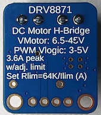

# drv8871

 

The [Adafruit DRV8871 DC Motor Driver](https://www.adafruit.com/product/3190) looks like a very capable driver for a single DC motor.

Within this folder, we have a demonstration on how to steer a motor with this driver, and how to read a motor's actual speed, using a Hall sensor.

>Note:
>
>If you have a different driver, chances are you can use the code as-such, or with little variations. The drivers fall into categories:
>
>|model|steering|
>|---|---|---|
>|drv8871|Separate PWM for forward (IN1) and backward (IN2)|

## Wiring


<!-- tbd. Consider making 'IN2' dashed / alternative is to just ground it, if we want to drive the motor only in one direction.
-->


## Running

```
$ cargo run --release --features= --example abc
```

>For `esp32c6`, add the `mcpwm` feature to use its dedicated Motor Control PWM circuitry.


## Hall sensor (optional)

Some motors provide hall sensors. The ones the author has access to have them in two ways:

*Small motor*

This has a separate sniffing board at the tail of the rotary axis, with two hall sensors (we only need one for the detection of speed). 

The board is separately wired (GND, +5V) from the MCU; so there are quite a many wires. However, this means the hall sensor signal is based on our MCU logic ground (not motor ground), which is great!

<!-- tbd. *additional* wiring (superimposed on above image)
-->

|motor|MCU|
|---|---| 
|Hall 1|`GPIO3`, for example|
|GND|GND|
|+5V|+5V|

Now, we can steer the motor not blindly by PWM, but by providing a *target speed* that the MCU constantly compares actual speed with, and adjusts the PWM.

This is very, very useful. Apply some pressure (friction) on the (slowly) rotating end of the motor, and notice how the PWM is increased, to give the motor more power. The rotating speed is now less affected by the load.

You can use any DC voltage to run the example. If it's too low, the motor won't start or, in hiking up the rounds, the program will complain that you ran out of the PWM range. This means you'd need a larger voltage to run with.

### Running

```
$
```

<!-- tbd.
## Hall sensor with opto-isolation (optional)

The bigger motor only provides three cables: Motor black, red and one Hall sensor input.

In this case, the hall sensor signal is *tbd. fill in*.

```
tbd.
- is the signal based on what?
- what is the signal level?  Does it follow the fed motor signal?
- instruct using an opto-isolator to bring it to MCU ground-based????

-->


## Details

### PWM frequency

To drive DC motors, a range of 1..20kHz PWM frequencies is mentioned in online documents as useful. Some sources recommend 2kHz as a starting point.

This matters for side effects of the motor spinning, such as audible noice, and (towards and beyond the high end) energy loss due to switching.

The author doesn't know. :) We go with 2..5kHz.
