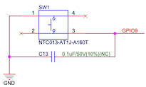

# Button pulls

>

*Figure 1. BOOT button routing in `ESP32-C3-DevkitC-02`* `[1]` &nbsp;&nbsp;&nbsp;&nbsp;&nbsp;&nbsp;&nbsp;&nbsp;&nbsp;&nbsp;&nbsp;&nbsp;&nbsp;&nbsp;&nbsp;*Same for `ESP32-C6-DevkitM-1`* `[2]`

Considering whether an internal resistor should be applied, when reading the devkit BOOT button, some observations and a conclusion.

|Observations|
|---|
|There is no external resistor in *Figure 1*.|
|There is a capacitor, parallel to the button. This is nice, since it avoids debounce. 🙂|
|The button is not connecting when depressed.|

**Reasons for pulling `Down`**

- `esp_hal` sample does it (did it): [source](https://github.com/esp-rs/esp-hal/blob/732c442c24adb9d1308aa6a9a838dd6a43f08e8d/examples/src/bin/wifi_ble.rs#L55-L61)

When NOT pushed, `GPIO9` would be in `GND`, emptying the `C13` capacitor.

When PUSHED, current would flow through the switch, and the internal resistor, between `GND` and `GND`. Thus, this cannot work. (but it does?)

**Reasons for pulling `Up`**

When NOT pushed, no current. `C13` fully loaded.

When PUSHED, current would flow from `GND`, through the internal resistor, to `Vcc`.

**Reasons for not pulling**

When NOT pushed, `GPIO9` would be hanging loose. That cannot be good.

## References

- [C3 DevKitC-02 schematics rev V1.1](https://dl.espressif.com/dl/schematics/SCH_ESP32-C3-DEVKITC-02_V1_1_20210126A.pdf) `[1]`
- [C6 DevKitM-1 schematics rev.1.0](https://docs.espressif.com/projects/esp-dev-kits/en/latest/esp32c6/_static/esp32-c6-devkitm-1/schematics/esp32-c6-devkitm-1-schematics.pdf) `[2]`
