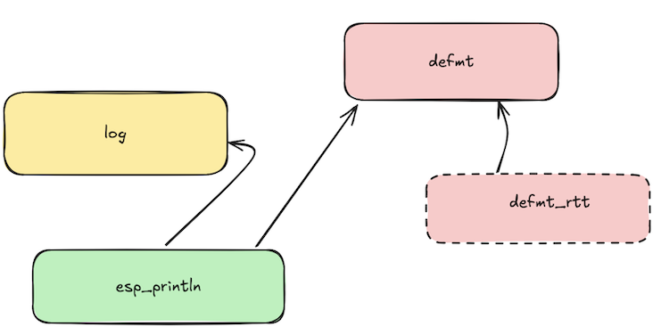

# `main`

This folder is for getting things started.


## Dev - check toolchain

```
$ CHIP=esp32c3 make ellie
```

- Should compile
- Uses Embassy
- Does not use hardware sensors, at all

```
$ CHIP=esp32c3 make ellie-run
```


<!-- tbd.
## Build library

## Test..
-->


## Logging

Logging is a bit more complex in ESP32 than it would need to be..



<!-- original in: ../.excalidraw/ -->

**log** is a Rust standard logging library. It can be used in Embassy via `esp_println/log` feature.

**defmt** is a "highly efficient" logging infrastructure made for embedded use, by Ferrous Systems. It can be used either stand-alone, or via `esp_println/defmt` feature.

**esp_println** is a crate provided by Espressif. It doesn't make much sense to use it as-is (its application API doesn't provide logging levels, for example), but since it ties to `log` and `defmt`, perhaps..?

**defmt_rtt** is a "real time transfer" protocol, part of the `defmt` ecosystem. Exactly what benefit it provides over plain use of `defmt` is still a bit open to the author..

||`esp32c3`|`esp32c6`|receiving side|
|---|---|---|---|
|`esp_println` + `log` (+ `defmt`)|works|...tbd...|`espflash` (and/or `probe-rs run`??)|
|`defmt` + `defmt_rtt`|logs don't show if `.await` is used(*)|works|`probe-rs run` only (for RTT)|

`(*)`: <small>*And what's the point of Embassy without `.await`.*</small>

### Reading on logging

- ["defmt, a highly efficient Rust logging framework for embedded devices"](https://ferrous-systems.com/blog/defmt) (blog, Aug'20; Ferrous Systems)

	*deferred formatting* = it passes the task of formatting log strings from embedded to the receiving host

	>`defmt`: To implement `Format` for user-defined types (structs or enums) use the `#[derive(Format)]` attribute

	<span />

	<!--
>there are formatting parameters for some primitives: e.g. `{:u8}`, `{:bool}`. Prefer these parameters for primitives as they compress the data better.
	-->

### Open issues!

- [ ] Does `espflash monitor` receive `defmt` - or do we always need to have `probe-rs` there?


### Pros / cons

||pros|cons|
|---|---|---|
|`probe-rs`|Cool! Would LOVE to use it!|Doesn't work with `riscv32imc` (no `a`=atomic extension) chips :(|
|`defmt`|parsed at the receipient; lighter on the chip||
|`deftm-rtt`|??|??|
|`log`|standard formatting|heavier on the chip|


### Hints


