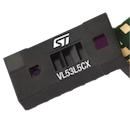
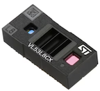

# L5CX vs L8CX

The library supports both VL53L5CX and VL53L8CX sensors. This page summarizes the differences between the two - intended to help you decide, which one is best suited for your needs.

## VL53L5CX

This product was introduced in 2021 and should be available until Jul'28 [source](https://www.st.com/en/imaging-and-photonics-solutions/vl53l5cx.html), according to the vendor's longevity commitment.

It has modes for either 4x4 or 8x8 resolution, and 45°x45° (65° diagonal) detection cone. 

Maximum distance is stated as "400cm" but note that this is with regards to a white object (maximum reflectance); your range may be lot less.

Maximum frame rate depends on the resolution:

- 60 Hz (4x4)
- 15 Hz (8x8)

Multitarget detection: Ability to detect not only first reflection depth, but up to four reflections within each zone.

Physical size of the module (w x l x h): 6.4 x 3.0 x 1.5 mm

Power requirement is stated as 4.5mW`|1|` but this depends on the mode you choose (resolution, frequency etc.).

<!-- tbd. pick the power req from other specs -->

>L5CX is no longer presented in the vendor's Time-of-Flight sensors [landing page](https://www.st.com/en/imaging-and-photonics-solutions/time-of-flight-sensors.html) (Aug'25), so the intension seems to be to direct people to use L8CX for new designs.

<small>`|1|`: ["New Time-of-Flight
technology enhances performance"](https://www.st.com/resource/en/application_presentation/march28th-2023-new-time-of-flight-technology-enhances-performance.pdf) (PDF 28pp.; vendor marketing material; Mar'23; page 8)</small>

## VL53L8CX

Many things are similar to VL53L5CX:

- same detection cone: 45°x45° (65° diagonal)
- same resolutions: 4x4, 8x8
- same frame rates (max): 60Hz (4x4), 15Hz (8x8)

Improvements:

- SPI (3MHz) comms available, in addition to I2C (1MHz)
- synchronization pin

Other changes:

- Introduced in 2023; longevity support until Jan'30.
- physical size (w x l x h): 6.4 x 3.0 x 1.75 mm
- power voltages are a bit different:

	||AVDD|IOVDD|
	|---|---|---|
	|L5CX|*"single 3.3 V or 2.8 V operation"*|*"1.8 V IOVDD" (optional)*
	|L8CX|*"1.8 V core supply and 3.3 V AVDD supply"*|*"Optional 1.2 V or 1.8 V IOVDD"*

- deep sleep mode

	The author is not convinced this matters. Since the device loses its firmware in such mode, a simple hard restart (completely switching off power when not used) would not be much different, he thinks.
	
	

## References

- ST.com > Imaging and photonics solutions > Time-of-Flight sensors > 
	- [VL53L5CX](https://www.st.com/en/imaging-and-photonics-solutions/vl53l5cx.html) > "read more..."
	- [VL53L8CX](https://www.st.com/en/imaging-and-photonics-solutions/vl53l8cx.html) > "read more..."
