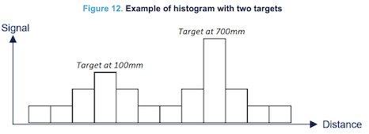

# `tof`

Support for using Time-of-Flight sensors (IR distance measurement), from Rust.

Following chips are supported:

- [VL53L5CX](https://www.st.com/en/imaging-and-photonics-solutions/vl53l5cx.html)
- [VL53L8CX](https://www.st.com/en/imaging-and-photonics-solutions/vl53l8cx.html)

You can use such sensors for:

- distance measurement (roughly 2..300cm, depending on reflectivity)
- movement and presence detection
- gesture control

The sensors provide 4x4 or 8x8 resolution, detecting the targets by local peaks in the reflected IR beams (see figure below).

>
>
><small>*Source: UM3109 - rev 11; page 12 (ST.com)*</small>

In this case, two targets are detected, one (strongest) at 70cm and a secondary (weaker) at 10cm.

NOTE!! In the figure, the distance <u>conveniently happens to be</u> exactly 600mm. Turns out, this is the *minimum distance* between any two targets. This is one of the limitations that you should be aware of. Others involve interplay of resolution modes vs. sampling rate vs. power consumption - and the role of reflectance **and ambient light** in signal strength and overall possibility of detecting stuff. Some spec numbers are taken in dark conditions; be aware!

We should take the time, some week, to study these features in depth and make e.g. an interactive web page that you can use to see, whether your case would fall within the possibilities of the sensor.

## Introductions

You need two libraries:

### [`vl53l5cx_uld`](vl53l5cx_uld/README.md) - Lower level C/Rust interface

ULD stands for ["Ultra Light Driver"](https://www.st.com/en/embedded-software/stsw-img023.html) - it's the vendor's terminology for their embedded C driver (not Linux).

This library provides the Rust/C interfacing, and some other goodies for providing a higher abstraction level than what the C level does (e.g. matrices are presented with x,y indices). 
	
You need to build this library prior to the other one; see instructions within `uld/README`.

### [`vl53l5cx`](vl53l5cx/README.md) - Application level API and examples

This project provides a "platform" adaptation for `esp-hal` I2C bus to talk with the lower level ULD library. It also uses Embassy to provide `async` interfaces for waiting for measurements.
	
This is the level you are expected to build your own applications on top.

>Note: Despite the naming, the libraries also work for the L8CX variant; it's a feature flag in the building of the `uld` library.

<!-- tbd. Reconsider the folder naming, once also L8CX works. 'vl', 'vl_uld', or 'rd' (Rust Driver), 'uld'.
-->

## Getting started

1. Check out the `ULD` project's [`README`](vl53l5cx_uld/README.md), follow the instructions.
   - Download the vendor C library [STSW-IMG023](https://www.st.com/en/embedded-software/stsw-img023.html) (for VL53L5CX) or [STSW-IMG040](https://www.st.com/en/embedded-software/stsw-img040.html) (for VL53L8CX).
2. Move to higher API project, build it, and run some examples.
3. Use in your projects.

