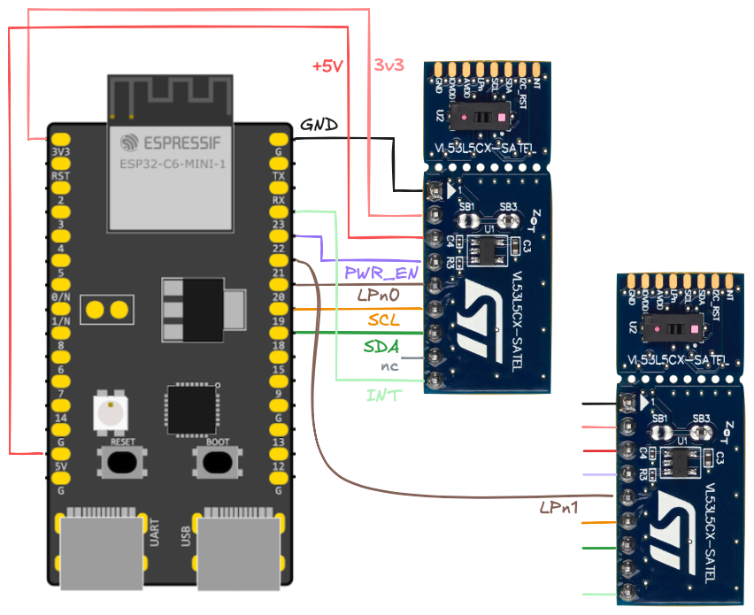

# `v53l5cx`

Higher level abstraction for the ST.com [VL53L5CX](https://www.st.com/en/imaging-and-photonics-solutions/vl53l5cx.html) sensors.

APIs for using either a single, or multiple such sensors at once.

## Wiring



*Figure 1. Wiring for ESP32-C6 and two sensors*

|wire|comment|
|---|---|
|`PWR_EN`|Can be used to force a power-down reset on the actual sensor. You *can* also pull this up to IOVDD (`|1|` suggests 47k), but the author has noticed it being more reliable to hard-reset the sensors at the start of each run.|
|`LPn{01}`|*tbd.*|
|`INT`|All boards share the same interrupt wire. Since it's a pull-down, any board needing the MCU's attention can signal that there's data ready.|

<!-- tbd. mention on LPn's, ONCE we understand them properly!! -->

> [!NOTE]
>If you use more than two boards, you should consider disabling some of the pull-up resistors. See the SATEL board schema<sup>`|1|`</sup>, and notice that there are following pull-ups on each mini-board:
>
>||ohm|
>|---|---|
>|`INT`|47k|
>|`LPn`|47k|
>|`SCL`|2.2k|
>|`SDA`|2.2k|
>
>These values are such that use of two, unmodified, boards still works. "Somewhere"<sup>`[*]`</sup> it was mentioned that I2C pull-ups above 1k should be fine. This means if you were to add a third board, you likely need to solder off `SB5` and `SB7` on at least one board. Do mark the ones that have been such modified! ;)
>
><small>`[*]`: *the author regrets not finding the source*</small>

## Run the examples

### Single

```
$ cargo build --release --features=distance_mm,defmt --example single
```

### Multiple boards

```
$ cargo build --release --features=distance_mm,defmt --example many-emb
```

## Unknowns...?


## References

- [Breakout Boards for VL53L5CX](https://www.st.com/en/evaluation-tools/vl53l5cx-satel.html) (ST.com)
- `1`: [PCB4109A, version 12, variant 00B](https://www.st.com/resource/en/schematic_pack/pcb4109a-00b-sch012.pdf) (ST.com; 2021; PDF 2pp.)

	>*Interestingly, marked `CONFIDENTIAL` but behind a public web link.* `#st.com`
