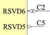

# Setting of I2C address

The VL53L5CX sensor doesn't seem to be designed with multiple-board use cases in mind. While it's possible to tie multiple boards on a single I2C bus, the mechanisms for doing so seem half-hearted, in practise. This markdown file discusses this aspect of the sensors.

>Disclaimer.
>
>It's perfectly possible that the author has missed something elementary. In that case, please let them know.

## What one can do

All boards start with address `0x52`. One can call the `vl53l5cx_set_i2c_address` function (or do similar I2C interactions), to change that address to another one, on the I2C bus. Once the address is changed, the board starts immediately recognizing the new address "on the fly".

### How this fares in practice?

Not well. Since all the boards start with address `0x52`, there needs to be a mechanism to shut them out, and target only a single one (say, for the above mentioned address change). This mechanism is the `LPn` pin (active high enables a certain chip).

To use `LPn`, one must carry an extra pin from the MCU to *every* sensor, separately. **This defeats the benefit of I2C bus**, which is to allow using multiple peripherals **without chip enable** signals.

>As we'll discuss below, there could have been other opportunities. Likely, the multi-sensor use case just didn't get much love and testing in product development...

This `LPn` use could be one-time, to get the sensors placed on the bus. After which they'd be separately addressable.

Or since the signals are anyways there, one can simple *forget about setting addresses altogether* and just pick the right sensor with its `LPn` signal. Which begs.. why have the ability to change the address, at all.

## What could have been

There are at least two ways the `VL53L5CX` could have improved on the multi-sensor use case.

### 1. Persisting the address

It's likely because of cost optimizations that the set I2C addresses are not (cannot be?) persisted on the sensors. If they were.., one could set the addresses permanently in production, using programming dots (no need for extra signal pins from the MCU).

Another variant of this would be to select the address by grounding certain pins. This is a pretty common method, but has the downsides of a) needing e.g. 3 extra pins on the sensor (for 8 different I2C addresses), b) not providing free address range anyways (causing possible conflict with other peripherals on the I2C bus).

>This, by the way, was the initial expectation of the author about the I2C address. Curiously, the address change mechanism is *not discussed anywhere* in the sensor documents, enforcing the author's feel that it's all just an afterthought (if you do it well, why not also documenting it, right?).

#### Implications

Instead of being able to prepare a number of chips, with unique I2C addresses, and route them with minimal wires, one now needs to handle the address changes at each reset. It doesn't take much time, but it's still a hassle.

#### Later note

The DS13754 datasheet (by the vendor; Figure 3), shows "non-volatile memory" as a feature of VL53L5CX.

### 2. Daisy-chaining

The `VL53L5CX` has unused pins (DS13754, Figure 5):

If this is so, each sensor could:

- start with the `0x52` default I2C address
- reflect whether it's in the default address by pulling such an output low

This allows the application engineer to chain such an output to the next sensor's `LPn`, effectively *disabling a chip if the previous one is using the default address*.

With this mechanism in place, the procedure of address changes (not persisted) becomes:

1. Reach for a sensor in `0x52`
2. If found, change its address
3. Repeat

The sensors would be given their addresses *without any extra wires from the MCU*.

Heck, maybe this *could* be done even with existing boards, with a firmware change? `RSVD6` is available on the packages and marked "Reserved" in the datasheet.
 
### Implications

Setting addresses in a daisy-chain fashion would be in the spirit of the I2C bus, allowing full range address selection while *not* requiring any line select pins, at all (from the MCU).

## The road we took

With the above ... restrictions ... the author thinks meddling with I2C address change is not worth it, as things stand. Since `n` * `LPn` pins are anyways needed, we can equally well use them for picking the board to address, and keep all boards at default `0x52` address.

### Implications

Things will work. MCUs have pins. PCBs can route them.

We can (if we want) set LEDs to the `LPn` pins, seeing indication on which board is currently being accessed. Note that this is just a visualization/debugging thing that matters nothing to the operation of the boards, themselves.

