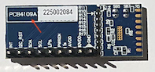
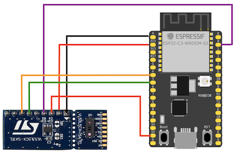

# Wiring

This document applies to a version of the [VL53L5CX-SATEL](https://www.st.com/en/evaluation-tools/vl53l5cx-satel.html#documentation) development boards marked with "PCB4109A" on the bottom side.

<!-- hidden (since there are problems with C3)

*Figure 1. Wiring the SATEL board with ESP32-C3-DevKit-C02*
-->

Below, we go through the SATEL pins, starting with "1".

|SATEL pin|ESP32 pin|comments|SATEL|What can I do with it?|
|---|---|---|---|---|
|GND|Gnd|
|IOVDD|3v3|Logic power|
|AVDD|5v / 3v3|Both AVDD and IOVDD must be provided for the SATEL board to function. <!-- *(Don't exactly understand, why, based on the schematics)*-->|
|PWR_EN|See `pins.toml` or +5V via 47k|It's enough to pull this high with e.g. 47k resistor. If you wish to explicitly control the reset/power cycle of the board, this is it.|Drives the `CE` (chip enable) of the larger board's regulator. The whole VL53L5CX chip is powered off, unless this signal is high.|Control the power cycle of the VC53L5CX chip.|
|LPn|---|Chip enable, active high.|Pulled via 47k to IOVDD.|Disable the chip momentarily from participating in I2C comms, by connecting to GND. *Not required in single-board operations.*|
|SCL|See `pins.toml`||Pulled via 2.2k to IOVDD. If you chain multiple boards, you may want to remove extra pull-ups. See [`../v53l5cx.multiple`](../v53l5cx.multiple/README.md)|Talk with the device.|
|SDA|-''-||-''-|-''-|
|I2C_RST|---|Active high. Pull momentarily up to reset the I2C target.|Pulled via 47k to GND.|Reset the I2C side by pulling the pin momentarily up while `PWR_EN` remains up. Not needed in practice.|
|INT|---|Active low (open drain)|Pulled via 47k to IOVDD.|Make the waiting for a new frame non-polling.|

For detailed description of the pins, see [`[1]`](https://www.st.com/resource/en/datasheet/vl53l5cx.pdf) table 3 ("VL53L5CX pin description").

`PWR_EN` is a pin specific to the larger part (5v -> 3v3 conversion) of the SATEL board.

## Quotes from other users

While the VL53L5CX module is properly documented by the vendor, the same is not the case for the SATEL breakout board. Also, its schematics were initially hard to find, being under "CAD Resources". Here are some quotes that helped in the understanding of what's going on - or that seem misguided to the author... ;)

<!-- hidden

|*"[...] SATEL has already the pull ups while the breakout board doesn't."* [source](https://community.st.com/t5/imaging-sensors/vl53l5cx-satel-won-t-respond-to-i2c/td-p/597080)|
|---|
|<strike>i.e. if you use the *larger* board, not SDA or SCL pull-ups are required. If you use the *smaller* board, you shall add those.</strike> This is clear in the Figures 1 and 2 or `[2]`.|
|This is **NOT ACCURATE** on the "PCB4109A" revision. There all the pull-ups are on the side of the *smaller* board.|
-->

|*"EDIT got it working by pulling up the PWREN line. Tho this was not written in the datasheet of the satel and [...]"* [source](https://community.st.com/t5/interface-and-connectivity-ics/i-cannot-see-the-vl53l5cx-device-on-the-i2c-bus-i-m-tried-it/td-p/231586)|
|---|
|the Other Person had used "22K pull up to AVDD (5V)". That likely works, but so does pulling up to IOVDD. The schematic for "PCB4109A" [`[3]`]() shows a dimmed (not installed) 47k pull-up to IOVDD. Thus, that seems recommendable.|

There are some references online about wiring the SATEL boards, but these seemed misleading. Perhaps the wiring of the boards has changed, over the years? Anyhow, it's best to trust the schematics `[3]`.

<!-- Editor's note:
There used to be some references to other uses here, but those sources are not helpful in wiring the SATEL correctly.
-->

## References

- `[1]`: [VL53L5CX Product overview](https://www.st.com/resource/en/datasheet/vl53l5cx.pdf) (ST.com DS13754, Rev 12; April 2024)
- `[2]`: [How to setup and run the VL53L5CX-SATEL using an STM32 Nucleo64 board]() (ST.com AN5717, Rev 2; Dec 2021)
- `[3]`: [PCB Schematic VL53L5CX-SATEL](https://www.st.com/en/evaluation-tools/vl53l5cx-satel.html#cad-resources) (ST.com; Rev A, ver 012, 2021)

	The schematics of the SATEL board (PCB4109A).

