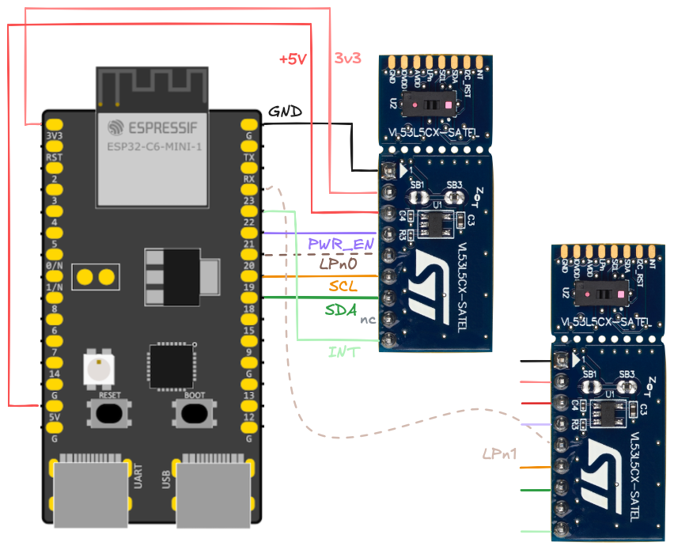

# Wiring

This wiring diagram serves both the `vl_api` and `vl_uld` levels.

## Wiring for VL53L8

*Figure 1. Wiring for ESP32-C6 and an L8*

## Wiring for two VL53L5CX sensors

*Figure 2. Wiring for ESP32-C6 and two L5CX sensors*

## Wires

|wire|comment|
|---|---|
|`INT`|All boards share the same interrupt wire. It's an open drain wire where any of the sensors can pull it down to indicate fresh data. The pulling down stops automatically after 100us.|
|`LPn{01}`|*"Drive this pin to logic 0 to disable the I2C comms."*`|1|`
In particular, the pin *DOES NOT have anything to do with the Low Power mode, despite its name.* We use it as a chip select, which it is.
NOTE: For running a single board, you can leave this pin unconnected (it has a pull-up within the SATEL board).|
|`PWR_EN`|Enables the regulators on the SATEL board. To reset the board, drive it low for 10ms. Note: In SATEL-VL53L8, it is connected to GND, via 100k.|
|`SCL`, `SDA`|The I2C bus|

<small>
`|1|` Table 3 in [VL53L5CX Product overview](https://www.st.com/resource/en/datasheet/vl53l5cx.pdf) (ST.com DS13754, Rev 12)
</small>

## Using in the `vl_uld` sub-project

>[!NOTE]
>
>You don't need to run the `vl_uld` examples (and thus, be concerned with wiring there), unless you do **development** of that library. If you just use it as an artefact, you can skip this section.

The ULD side is simpler than the `vl_api` (current folder), and the wiring is planned so that you **do not need to change physical routing** if switching between the two projects. However, here are some details it's good to be aware of:

- `LPn` wouldn't be needed for ULD (just using a single board), but if enabled in `pins.toml`, it's driven also there. For the **first board**.
- `SYNC` pin is not used (it's an input)

The rest of the pins work the same.

## Using more than 2 boards

If you use more than two boards, you'll need to **disable some of the pull-up resistors**. See the SATEL board schema`|2|`, and notice that there are following pull-ups on each mini-board:

||ohm|
|---|---|
|`INT`|47k|
|`LPn`|47k|
|`SCL`|2.2k|
|`SDA`|2.2k|
|`SYNC` (L8 only)|47k|

These values are such that use of two unmodified boards still works. "Somewhere"`|*|` it was mentioned that I2C pull-ups above 1k should be fine. This means if you were to add a third board, you likely need to solder off `SB5` and `SB7` on at least one board. 

Do mark the boards that have received such modification, for your own good!!

<small>
`|2|` [PCB4109A, version 12, variant 00B](https://www.st.com/resource/en/schematic_pack/pcb4109a-00b-sch012.pdf) (ST.com; 2021; PDF 2pp.)

`|*|`: *the author regrets not finding the source*</small>
</small>
