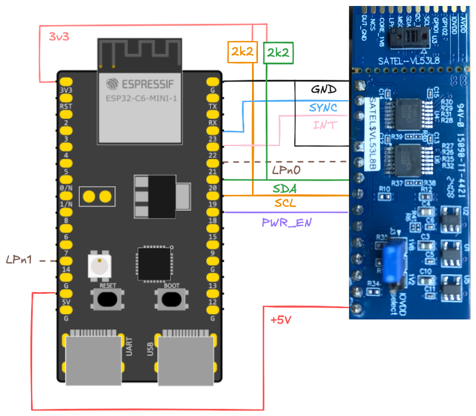
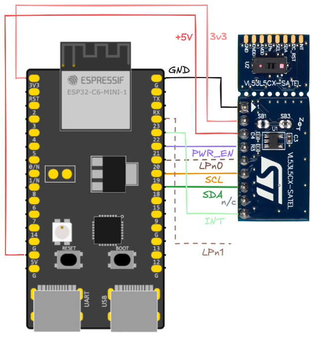
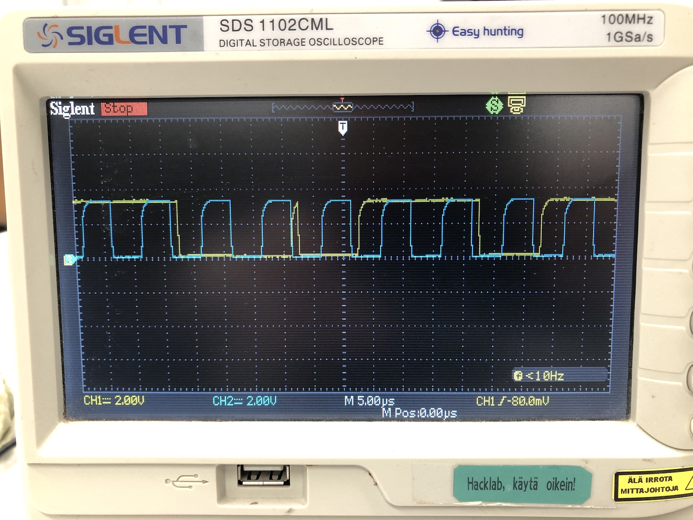
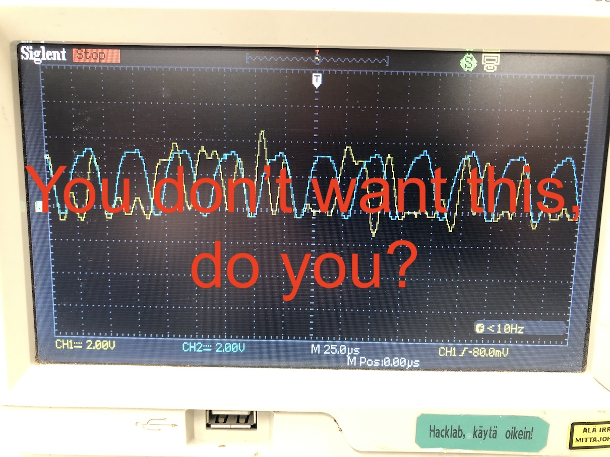

# Wiring

This wiring diagram serves both the `vl_api` and `vl_uld` levels.

## Wiring for VL53L8

*Figure 1. Wiring for ESP32-C6 and an L8*

The SATEL-VL53L8 sports two level translators (the largest IC's in the image). These convert the external signals (`"AVDD (3.3V)"`) to the ones the sensor uses (`"IOVDD (1.2V or 1.8V)"`). This means, when we do pull-ups, they should be connected to 3v3.

## Wiring for VL53L5CX

*Figure 2. Wiring for ESP32-C6 and two L5CX sensors*

## Wires

<!-- #editor's comment
alphabetical order:
-->

|wire|comment|
|---|---|
|`INT`|All boards share the same interrupt wire. It's an open drain wire where any of the sensors can pull it down to indicate fresh data. The pulling down stops automatically after 100us (both L8 and L5CX)`|2|`.|
|`LPn{01}`|*"Drive this pin to logic 0 to disable the I2C comms."*`|1|`
In particular, the pin *does not have anything to do with the Low Power mode*, despite its name. We use it as a chip select, which it is.|
|`PWR_EN`|Enables the regulators on the SATEL board. To reset the board, drive it low for 10ms.|
|`SCL`, `SDA`|The I2C bus|
|`SPI_I2Cn`|L8 specific: selects between I2C (low) or SPI (high) protocol. Connect to ground.|
|`SYNC`|L8 specfic: synchronize multiple boards' scans to start at the same cue. *tbd. mention polarity here*|

<small>
`|1|` [DS13754](https://www.st.com/resource/en/datasheet/vl53l5cx.pdf) - Rev 12 - Table 3 
`|2|` [UM3109](https://www.st.com/resource/en/user_manual/um3109-a-guide-for-using-the-vl53l8cx-lowpower-highperformance-timeofflight-multizone-ranging-sensor-stmicroelectronics.pdf) - Rev 12 - Chapter 5.3
</small>

## Need of pull-up resistors

Pull-up resistors on the I2C bus (SCL, SDA) affect the quality of the signals, and thus the frequencies that you can operate the bus with.

Because of the level translators, the situation is a bit different on SATEL-VL53L8 vs. VL53L5CX-SATEL. Let's tackle them separately.

*Figure 3. Reasonably good looking wave forms (L8, 4k pull-ups, 400kHz).*

### SATEL-VL53L8

The L8 SATEL has two "level translator" circuits between the actual sensor ("DUT" in the vendor schematics) and the host. These level translators (PI4ULS3V204 to be precise) have integrated 10kΩ pull-ups for all their signals. This includes the SDA and SCL.

10kΩ is not ideal for I2C, but it works.

>

*Figure 4. Soft-looking waveforms - but I2C works (L8, no external pull-ups, 100kHz).*

|freq|requirement|
|---|---|
|100k|works without external pull-ups|
|400k|4k or 2k|
|1M|2k|

**The author recommends pulling up with external 2k resistors.** These can be placed to take their voltage from the `3v3` pin of the SATEL, itself - as shown in Figure 1 - or from the MCU.

If you use **multiple sensors** on the same bus, the same 2k's should work well also then. Each SATEL adds their 10k in parallel with the external resistor, leading to an overall pull of 1k for four SATEL boards. That's within I2C bounds.

However, **always ensure the signal quality** with your production build. Timeouts, failures to get ACK are normally the result of wrong amount of pull-up. You might not get those in your "lab", but they might start hurting on the field.
 

### VL53L5CX-SATEL

The `L5CX` SATELs don't sport level translators, and if you use more than two boards, you'll need to **disable some of the pull-up resistors**. 

See the SATEL board schema`|*|`, and notice that there are following pull-ups on each mini-board:

||ohm|
|---|---|
|`INT`|47k|
|`LPn`|47k|
|`SCL`|2.2k|
|`SDA`|2.2k|

These values are such that use of two unmodified boards still works, but eventually the pull-up for the I2C bus becomes too strong (its resistance too weak). The formula is: `R = 2200 / N`.

|N|total pull-up|power lost to pull-up|good?|
|---|---|---|---|
|2|1.1k|yup|
|3|0.73k|perhaps?|
|4|0.55k|-''-|

This means if you were to add a third board, you likely need to solder off `SB5` and `SB7` on some board(s). **Do mark the boards that have received such modification**, for your own good!! :)

<small>
`|*|` [PCB4109A, version 12, variant 00B](https://www.st.com/resource/en/schematic_pack/pcb4109a-00b-sch012.pdf) (ST.com; 2021; PDF 2pp.)
</small>
