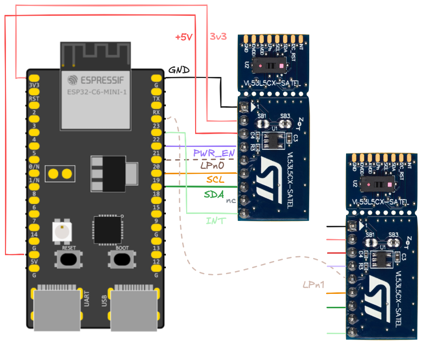

# Wiring

*Figure 1. Wiring for ESP32-C6 and two sensors*

|wire|comment|
|---|---|
|`PWR_EN`|Drives a power-down reset of the sensor(s). You *can* also pull this up to IOVDD `|1|` suggests via 47k, but the author has noticed it being more reliable to hard-reset the sensors at the start of each run.|
|`LPn{01}`|*"Drive this pin to logic 0 to disable the I2C comms."*`|1|`
In particular, the pin *DOES NOT have anything to do with the Low Power mode, despite its name.* We use it as a chip select, which it is.
NOTE: For running a single board, you can leave this pin unconnected (since it's a pull-down chip disable). This means you can use the same board layout as in the `ULD` part of the repo.|
|`SCL`, `SDA`|The I2C bus|
|`INT`|All boards share the same interrupt wire. It's an open drain wire where any of the sensors can pull it down to indicate fresh data. The pulling down stops automatically after 100us.|

<!-- Editor's note: 
`\|` backslashes needed for IntelliJ Markdown plugin (otherwise confuses to table syntax. note2: don't... really mind that; use a dedicated MD editor for this file!
-->

<small>
`|1|` Table 3 in [VL53L5CX Product overview](https://www.st.com/resource/en/datasheet/vl53l5cx.pdf) (ST.com DS13754, Rev 12)
</small>

## Using more than 2 boards

If you use more than two boards, you'll need to **disable some of the pull-up resistors**. See the SATEL board schema`|2|`, and notice that there are following pull-ups on each mini-board:

||ohm|
|---|---|
|`INT`|47k|
|`LPn`|47k|
|`SCL`|2.2k|
|`SDA`|2.2k|

These values are such that use of two unmodified boards still works. "Somewhere"`|*|` it was mentioned that I2C pull-ups above 1k should be fine. This means if you were to add a third board, you likely need to solder off `SB5` and `SB7` on at least one board. 

Do mark the boards that have received such modification, for your own good!!

<small>
`|2|` [PCB4109A, version 12, variant 00B](https://www.st.com/resource/en/schematic_pack/pcb4109a-00b-sch012.pdf) (ST.com; 2021; PDF 2pp.)

`|*|`: *the author regrets not finding the source*</small>
</small>
