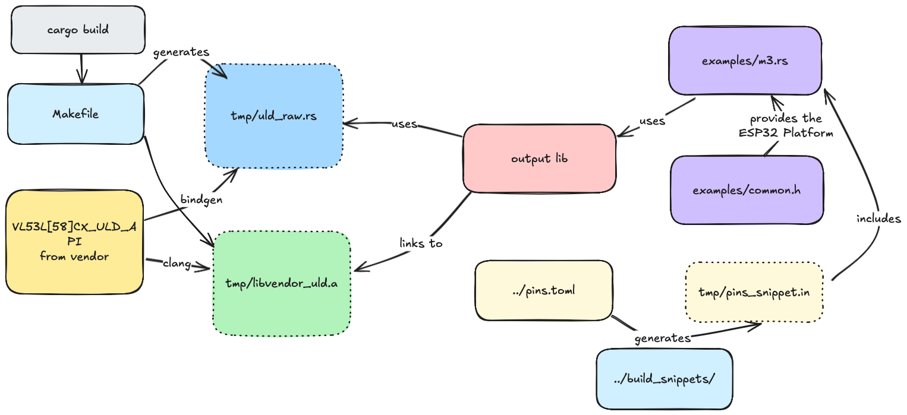

# `v53l5cx_uld`

The `uld` part for the VL53L5CX time-of-flight sensor takes care of

- C/Rust adaptation
- translation of results from 1D vectors to 2D matrices
- enums in place of "magic" integer values

YOU SHOULD NOT USE THIS LEVEL IN AN APPLICATION. Use the [`vl53l5cx`](../vl53l5cx/README.md) API instead (which depends on us). Before that, though, read on, install the build requirements so that the higher API can also be built.

>Note: We don't automatically pull in the vendor ULD C library, because it requires a "click through" license. You can download it as a guest, though, and you can use a non-traceable (temporary) email address.


## Overview



This build is relatively complex. You can just follow the instructions below, but in case there are problems, the above map may be of help.

## Supported dev kits

The workflow has been tested on these MCUs and sensors:

|||`L8CX`|`L5CX`|
|---|---|---|---|
|`esp32c6`|[ESP32-C6-DevKitM-01](https://docs.espressif.com/projects/esp-dev-kits/en/latest/esp32c6/esp32-c6-devkitm-1/user_guide.html)|*tbd.*|&check;|
|`esp32c3`|[ESP32-C3-DevKitC-02](https://docs.espressif.com/projects/esp-idf/en/stable/esp32c3/hw-reference/esp32c3/user-guide-devkitc-02.html)|*tbd.*|*tbd. check again..*|

<!-- #hidden
|`esp32c3`|[ESP32-C3-DevKitC-02](https://docs.espressif.com/projects/esp-idf/en/stable/esp32c3/hw-reference/esp32c3/user-guide-devkitc-02.html) with JTAG/USB wiring added<p />*❗️ESP32-C3 has problems with long I2C transfers, in combination with the `probe-rs` tool. Sadly, we cannot really recommend using it. See  [`../../TROUBLES.md`](../../TROUBLES.md) for details.*|
-->


## Requirements

### `espflash` or `probe-rs`

Follow installation instructions at the [root](../../README.md) of the ZOO repo.

```
$ espflash --version
espflash 4.0.1
```


### `clang`

```
$ sudo apt install libclang-dev clang
```

### `bindgen`

```
$ cargo install bindgen-cli
```

<!-- author's note:
`bindgen` is available also via `apt`, but the version seems to lag behind (perhaps is special for the Linux kernel use; don't know). At the time, `cargo install` is 0.71.1 while `apt show bindgen` gives:
>Version: 0.66.1-4
-->

>Note: Bindgen docs recommend using it as a library, but we prefer to use it as a command line tool.

<!-- Developed with:
$ clang --version
Ubuntu clang version 18.1.3 (1ubuntu1)
[...]

$ bindgen --version
bindgen 0.72.0
-->

### Tools

```
$ sudo apt install make patch dos2unix
```


### The vendor C libary

The vendor's C driver is a separate download, with a click-through license.

1. Fetch a zip from the vendor:

	(product page) > `Tools & Software` > "Ultra lite driver (ULD) API"

	- for [VL53L8CX](https://www.st.com/en/embedded-software/stsw-img040.html)
	- for [VL53L5CX](https://www.st.com/en/embedded-software/stsw-img023.html) 

	`Get software` > `Get latest` > check the license > ...

	You can `"Download as a guest"`, after clicking the license. You *will* need to provide an email address for the actual download link, but that can be a temporary one...

2. Unzip to a suitable location

3. `export VL53L8CX_ULD_API={your-path}/VL53L8CX_ULD_API`

	If you are targeting VL53L5CX, you just change the `8` to `5`, naturally. You can also have both API's available.

	>We only need the one subfolder that has `src`, `inc`, not the whole unzipped contents which has examples, docs etc.
	

### SATEL board

One [SATEL board](https://www.st.com/en/evaluation-tools/vl53l5cx-satel.html) is needed. 

For wiring, see [`pins.toml`](./pins.toml):

```
[boards.esp32c3]
SDA = 4
SCL = 5
PWR_EN = 6
INT=7

[boards.esp32c6]
SDA = 18
SCL = 19
PWR_EN = 21
INT = 22
```


## Running examples

Test the code with:

```
$ make -f Makefile.dev m3
[...]
0.870700 [INFO ] Target powered off and on again.
0.874266 [DEBUG] Ping succeeded: 0xf0,0x02
3.639815 [INFO ] Init succeeded
4.008711 [DEBUG] INT after: 24.442ms
4.024860 [INFO ] Data #0 (32°C)
4.024911 [INFO ] .target_status:    [[[SemiValid(6), SemiValid(6), SemiValid(6), SemiValid(6)], [SemiValid(6), SemiValid(6), SemiValid(6), SemiValid(6)], [SemiValid(6), SemiValid(6), SemiValid(6), SemiValid(6)], [SemiValid(6), SemiValid(6), SemiValid(6), SemiValid(6)]], [[SemiValid(6), SemiValid(6), SemiValid(6), SemiValid(6)], [SemiValid(6), SemiValid(6), SemiValid(6), SemiValid(6)], [SemiValid(6), SemiValid(6), SemiValid(6), SemiValid(6)], [SemiValid(6), SemiValid(6), SemiValid(6), SemiValid(6)]]]
4.025215 [INFO ] .targets_detected: [[2, 2, 2, 2], [2, 2, 2, 2], [2, 2, 2, 2], [2, 2, 2, 2]]
4.025322 [INFO ] .ambient_per_spad: [[1, 1, 1, 2], [1, 2, 1, 0], [1, 1, 1, 1], [0, 0, 1, 1]]
4.025446 [INFO ] .spads_enabled:    [[16128, 15872, 15104, 15872], [15104, 15104, 15872, 12800], [15616, 14848, 15616, 11264], [15360, 15360, 15872, 10240]]
4.025566 [INFO ] .signal_per_spad:  [[[137, 144, 222, 345], [154, 92, 168, 325], [120, 105, 204, 415], [112, 165, 262, 572]], [[122, 34, 26, 16], [148, 20, 12, 10], [83, 6, 16, 11], [28, 22, 26, 12]]]
4.025800 [INFO ] .range_sigma_mm:   [[[3, 2, 1, 1], [4, 3, 2, 1], [4, 3, 1, 1], [2, 2, 1, 1]], [[3, 5, 7, 9], [2, 12, 17, 12], [6, 28, 8, 12], [8, 8, 6, 13]]]
4.025994 [INFO ] .distance_mm:      [[[38, 0, 1, 0], [142, 11, 0, 0], [73, 7, 0, 0], [0, 0, 0, 0]], [[300, 202, 907, 933], [253, 1043, 808, 646], [220, 642, 708, 724], [393, 606, 642, 653]]]
4.026182 [INFO ] .reflectance:      [[[0, 0, 0, 0], [4, 0, 0, 0], [1, 0, 0, 0], [0, 0, 0, 0]], [[15, 2, 30, 19], [13, 31, 11, 6], [5, 3, 12, 8], [6, 11, 15, 8]]]
4.069097 [DEBUG] INT after: 42.756ms
[...]
Firmware exited successfully
```

If you have an ESP32-C3 board, this will fail. Use `make -f Makefile.dev m3-with-espflash`, instead.

	
## References

### VL53L5CX

- [Breakout Boards for VL53L5CX](https://www.st.com/en/evaluation-tools/vl53l5cx-satel.html) (ST.com)
- [Ultra Lite Driver (ULD) for VL53L5CX multi-zone sensor](https://www.st.com/en/embedded-software/stsw-img023.html) (ST.com)

	- ["Ultra lite driver (ULD) [...] with wide field of view"](https://www.st.com/resource/en/data_brief/stsw-img023.pdf) (PDF, May'21; 3pp)
	- ["A guide to using the VL53L5CX multizone [...]"](https://www.st.com/resource/en/user_manual/um2884-a-guide-to-using-the-vl53l5cx-multizone-timeofflight-ranging-sensor-with-a-wide-field-of-view-ultra-lite-driver-uld-stmicroelectronics.pdf) (PDF, revised Feb'24; 18pp)

- [VL53L5CX Product overview](https://www.st.com/resource/en/datasheet/vl53l5cx.pdf) (ST.com DS13754, Rev 13; Sep 2024)

### SATEL

- [How to setup and run the VL53L5CX-SATEL using an STM32 Nucleo64 board](https://www.st.com/resource/en/application_note/an5717-how-to-setup-and-run-the-vl53l5cxsatelusing-an-stm32-nucleo64-board-stmicroelectronics.pdf) (ST.com AN5717, Rev 4; Dec 2024)

- [PCB4109A, version 12, variant 00B](https://community.st.com/ysqtg83639/attachments/ysqtg83639/imaging-sensors-forum/1559/1/PCB4109A-00B-SCH012.pdf) (ST.com; Apr 2021; PDF 2pp.)

<!-- earlier URL (now 404):
https://www.st.com/resource/en/schematic_pack/pcb4109a-00b-sch012.pdf
-->
