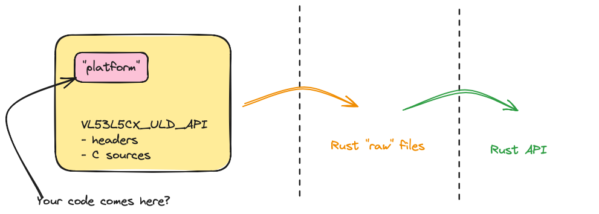

# `uld-sys`

Turns the `VL53L5CX_ULD_API` source code into something that can be touched with Rust.

## Pre-reading

- ["Using C Libraries in Rust"](https://medium.com/dwelo-r-d/using-c-libraries-in-rust-13961948c72a) (blog, Aug '19)

   A bit old, but relevant (C API's don't age!).
   
- [`bindgen` book](https://rust-lang.github.io/rust-bindgen/introduction.html)

  >Note: Not that you really need to pre-read the above. `#joking`

## The job

>*tbd. CHANGES TO THE IMAGE ARE LIKELY!*

## References

- [Ultra Lite Driver (ULD) for VL53L5CX multi-zone sensor](https://www.st.com/en/embedded-software/stsw-img023.html) (ST.com)

