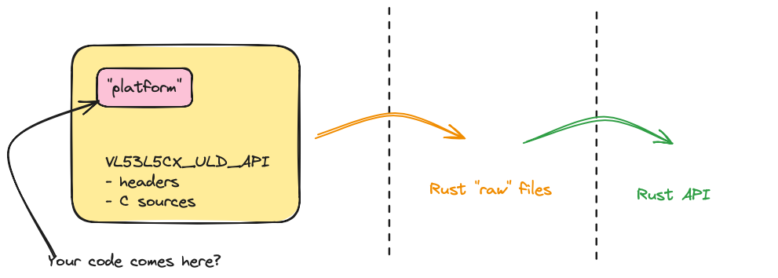

# `v53l5cx_uld`

Turns the `VL53L5CX_ULD_API` source code into something that can be touched with Rust.

>Note: Usually Rust/C bindings are done in two layers: a `-sys` library forming a 1-to-1 bridging to C code, and another library adapting the use for Rust.
>
>We *kind of* have this approach, by having a a `src/uld_raw.rs` generated by `bindgen` from C sources. But these are in the one Rust module, not two separate.
>Currently, we are keeping everything together (for simplicity); depends on the amount of Rust adaptation.

**The one thing this level doesn't do is *be aware of Embassy* in any way (`async/.await`).**

## Pre-reading

- ["Using C Libraries in Rust"](https://medium.com/dwelo-r-d/using-c-libraries-in-rust-13961948c72a) (blog, Aug '19)

   A bit old, but relevant (C API's don't age!).
   
## The job



><font color=orange>*tbd. CHANGES TO THE IMAGE ARE LIKELY!*</font>


## Requirements

See hardware and software requirements -> [`../README`](../README.md).

<!--
```
$ clang -print-targets | grep riscv32
    riscv32     - 32-bit RISC-V
    riscv64     - 64-bit RISC-V
```
-->

## Preparation

The workflow has been tested on these MCUs:

|||
|---|---|
|`esp32c3` (default)|[ESP32-C3-DevKitC-02](https://docs.espressif.com/projects/esp-idf/en/stable/esp32c3/hw-reference/esp32c3/user-guide-devkitc-02.html) dev kit, with JTAG/USB wiring added|
|`esp32c6`|[ESP32-C6-DevKitM-01](https://docs.espressif.com/projects/esp-dev-kits/en/latest/esp32c6/esp32-c6-devkitm-1/user_guide.html)|

If you are using ESP32-C3, the repo is ready for use.

### Setting the target

To use ESP32-C6, run this once:

```
$ ./set-target.sh
```

<!--
Check `.cargo/config.toml` and `Cargo.toml` that any references to `target` or `chip` are correct.

>tbd. There's planned to be a `./set-target.sh` script that asks the chip type and verifies/changes these files, for you.
-->

## Compiling 

```
$ cargo build --release --lib
```

The command uses `Makefile.inner` internally. You can also use it directly; have a look at its contents.

<!--remove
<span />

>Note: Somewhat unintuitively, the build doesn't have any Chip-specific features. No `esp32c3`-like. This is *either* because
>
>- a) the compilation (`clang`) is done using a single target that covers all ESP32 (RISC-V) chips: `riscv32`
>- b) the author hasn't really cracked it; such features *will* be needed!!
-->

## Running samples

>For C3 boards, before running:
>- reset the board
>- re-attach it on USB/IP
>
>This needs to be done anew *before each run*. ESP32-C6 boards don't need such resets.

```
$ cargo run --release --features=defmt --example nada
[...]
      Erasing ✔ [00:00:03] [#############] 192.00 KiB/192.00 KiB @ 53.17 KiB/s (eta 0s )
  Programming ✔ [00:00:18] [#############] 22.54 KiB/22.54 KiB @ 1.23 KiB/s (eta 0s )    Finished in 18.28534s
INFO  Nada
DEBUG Ding!
DEBUG Dong!
...
```

```
$ cargo run --release --features=defmt --example _1-ranging_basic
```

|||
|---|---|
|`nada`|Checks the build setup and `defmt` logging; no sensor activity|
|`_1-ranging_basic`|...|


*tbd. Hardware setup for those.*

<!-- (already said)
## Troubleshooting

### No log output on ESP32-C3

```
$ probe-rs run --chip=esp32c3 --log-format '{L}_{s}' target/riscv32imc-unknown-none-elf/release/examples/nada
      Erasing ✔ [00:00:03] [###########################################################] 192.00 KiB/192.00 KiB @ 57.05 KiB/s (eta 0s )
  Programming ✔ [00:00:18] [##############################################################] 22.54 KiB/22.54 KiB @ 1.25 KiB/s (eta 0s )    Finished in 18.072815s


```

The C3 board needs a physical reset (and reattaching) prior to each run.

- push the `RESET` button
- re-attach on USB/IP: e.g. `sudo attach -r 192.168.1.29 -b 3-1`
- try again
-->

## References

- [Ultra Lite Driver (ULD) for VL53L5CX multi-zone sensor](https://www.st.com/en/embedded-software/stsw-img023.html) (ST.com)


