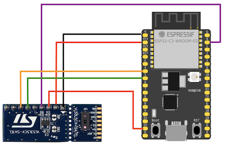
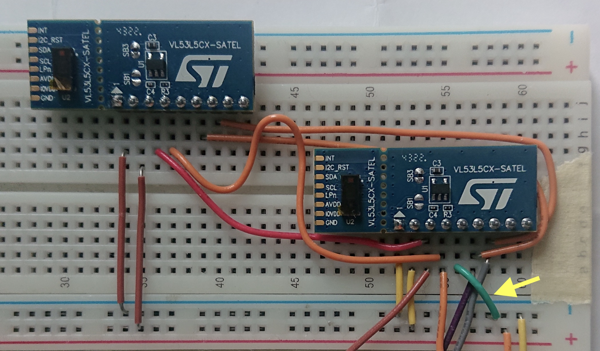
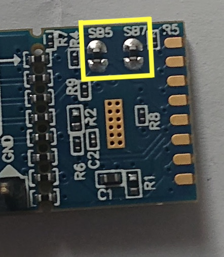

# Wiring

This document applies to a version of the [VL53L5CX-SATEL](https://www.st.com/en/evaluation-tools/vl53l5cx-satel.html#documentation) development boards marked with "PCB4109A" on the bottom side.

*Figure 1. Wiring the SATEL board with ESP32-C3-DevKit-C02*

Below, we go through the SATEL pins from left to right.

|SATEL pin|ESP32 pin|comments|SATEL|What can I do with it?|
|---|---|---|---|---|
|INT|---|Active low (open drain)|Pulled via 47k to IOVDD.|Make the waiting for a new frame non-polling. *(tbd. confirm by testing)*|
|I2C_RST|---|Active high. Toggle `0->1->0` to reset the I2C target.|Pulled via 47k to GND.|Reset the I2C side by pulling the pin momentarily up while `PWR_EN` remains up. Not needed in practice.|
|SDA|GPIO4|same pin as in a `esp-hal` I2C example|Pulled via 2.2k to IOVDD. If you chain multiple boards, you may want to remove extra pull-ups by soldering open `SB5`, `SB7` on the underside of boards.(2)|Talk with the device.|
|SCL|GPIO5|-''-|-''-|-''-|
|LPn|---|Chip enable, active high.|Pulled via 47k to IOVDD.|Disable the chip momentarily, by connecting to GND. Suggested to be used for programming non-default I2C addresses, but this can be reached also by simply plugging such chips in, on their own.(1)|
|PWR_EN|(GPIO0)|Drive directly with a GPIO pin, or pull up with e.g. 47k to IOVDD.|Drives the `CE` (chip enable) of the larger board's regulator. The whole VL53L5CX chip is powered off, unless this signal is high.|Control the power cycle of the VC53L5CX chip.|
|AVDD|5v / 3v3|Both AVDD and IOVDD must be provided, for the SATEL board to function. *(don't exactly understand, why, based on the schematics)*|
|IOVDD|3v3|-''-|
|GND|Gnd|

`(1)`: Haven't tried. If the VL device doesn't have persistent memory of its I2C address, one needs to initialize them via this feature (disable all but one; program the I2C address).

`(2)`: See [Wiring multiple boards](), below.

>For detailed description of the pins, see [`[1]`](https://www.st.com/resource/en/datasheet/vl53l5cx.pdf) table 3 ("VL53L5CX pin description").
>
>`PWR_EN` is a pin specific to the larger part (5v -> 3v3 conversion) of the SATEL board.

**Quotes**

|*"[...] SATEL has already the pull ups while the breakout board doesn't."* [source](https://community.st.com/t5/imaging-sensors/vl53l5cx-satel-won-t-respond-to-i2c/td-p/597080)|
|---|
|<strike>i.e. if you use the *larger* board, not SDA or SCL pull-ups are required. If you use the *smaller* board, you shall add those.</strike> This is clear in the Figures 1 and 2 or `[2]`.|
|This is **NOT ACCURATE** on the "PCB4109A" revision. There all the pull-ups are on the side of the *smaller* board.|

|*"EDIT got it working by pulling up the PWREN line. Tho this was not written in the datasheet of the satel and [...]"* [source](https://community.st.com/t5/interface-and-connectivity-ics/i-cannot-see-the-vl53l5cx-device-on-the-i2c-bus-i-m-tried-it/td-p/231586)|
|---|
|the Other Person had used "22K pull up to AVDD (5V)". That likely works, but so does pulling up to IOVDD. The schematic for "PCB4109A" [`[3]`]() shows a dimmed (not installed) 47k pull-up to IOVDD. Thus, that seems recommendable.|

**Other users**

[This example](https://github.com/stm32duino/VL53L5CX/blob/main/README.md) (Arduino library) has connected the pins like mentioned in the Nucleo document. But that seems overkill - we'd rather connect as few to active GPIO as possible (leaving that to the application engineer).

Based on [this ESP-focused library](https://github.com/RJRP44/VL53L5CX-Library) we should be able to get going with:

- pull-ups (2.2K) in both `SDA` and `SCL` *(only needed if using the smaller board)*
- pull-up (47K) in `LPn` (he's tied it up, but vendor docs demand a resistor)

In particular, the following had been left unconnected: `INT`, `I2C_RST`, `PWR_EN`

## Wiring multiple boards

Above, two SATEL boards are connected to the same MCU. One of them is disabled (for programming the I2C address of the other one), by connecting `LPn` pin to the ground.

---

Multiple SATEL boards are intended to be chained together; they are I2C peripherals, after all.

### Setting the I2C address

For each but one board, you'll first need to set their I2C addresses to something else than the default `0x52`. Note that the vendor uses "8 bit addresses", meaning actual next address is `0x54`, then `0x56` and so forth.

You can do this programming in either of these ways:

**1. One board at a time**

In this scenario, you physically connect only one SATEL board to the MCU, and run the address reprogramming command (below).

**2. Disabling other boards via `LPn` pin**

Here (presented in the picture above, for two boards), multiple boards (with still their default I2C addresses) can co-exist, as long as you disable the ones you don't want to participate. Do this by connecting the `LPn` pin(s) of excluded boards to ground.

>There is a 47K pull-up resistor for the `LPn` pin, within each SATEL board. Thus, if you leave it open, the board will be active.

Then run the reprogramming command on the I2C bus.

### Reprogramming the address

>tbd. Something like: `NEW_ADDRESS=0x54 [OLD_ADDRESS=0x52] cargo run --release --bin readdress`

### More than 2 boards

In the picture above, the `SDA` and `SCL` pins had simply been connected between the two boards. Since each of them carries 2.2k pull-up resistors for these pins, the overall pull-up resistance is now just 1.1k.

If you were to add a third board, the value drops below the recommended 1k Don't remember where I saww this, but it was an authorative source, so instead:

Open the `SB5` and `SB7` solder bridges (picture below).

## Open issues

### More I2C buses needed?

Once all this is done, you should be able to use a few boards on the same I2C bus, from a single MCU. Eventually, the bandwidth of the I2C bus should become the bottleneck, limiting the scanning frequencies you can use on the system.

The author hasn't reached this, yet. If you do, please drop a line (PR) about where the limits were.

<!-- tbd. chart on available bandwidth (scan frequencies) with 3..4 boards connected
-->

## References

- `[1]`: [VL53L5CX Product overview](https://www.st.com/resource/en/datasheet/vl53l5cx.pdf) (ST.com DS13754, Rev 12; April 2024)
- `[2]`: [How to setup and run the VL53L5CX-SATEL using an STM32 Nucleo64 board]() (ST.com AN5717, Rev 2; Dec 2021)
- `[3]`: [PCB Schematic VL53L5CX-SATEL](https://www.st.com/en/evaluation-tools/vl53l5cx-satel.html#cad-resources) (ST.com; Rev A, ver 012, 2021)

	The schematics of the SATEL board (PCB4109A).

