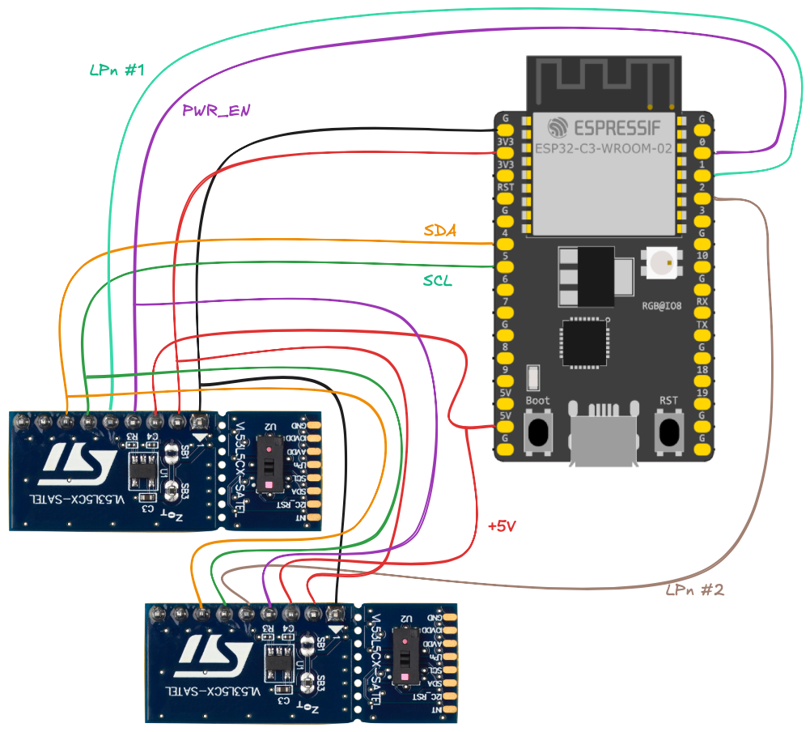

# Working with multiple VL53L5CX boards

If you want to work with multiple VL53L5CX sensors at the same time, you'll need to change their I2C addresses.


## Changing I2C addresses

The VL53L5CX boards **do not** persist their given I2C addresses. Every board, after each restart, starts with the address `0x52`.

In order to work with multiple boards, one needs to either:

- have them on separate I2C buses (not practical)
- initialize them with different I2C addresses, on the same bus
- switch them on/off using the `LPn` line, for each communications

In order to initialize the boards to be on the same I2C bus, one needs N wires from the MCU, in order to gradually bring them on the bus.




## Exercise!

1. Create the wiring shown above (2 or more boards)
2. Update `pins.toml` (its `LPn` array):

   ```toml
   LPn = [2,3]
   ```
   
   The default has the image's setup. For example to add a third board, just do this:
   
   ```toml
   LPn = [2,3,4]
   ```

3. Run the example

   ```
   $ make multiboard
   ```

   *tbd. Complete!*

4. Interactively, see how one after the other board is detected, and its addresses changed.

5. At the end, there's a data demo pulling data from all the added boards.

Note that the steps 3..4 need to be repeated in the beginning of any multiboard exercise. It may be that merely starting a new `probe-rs` session doesn't reset your fleet, but the examples pull `PWR_EN` down for some `ms`s, in order to guarantee a known-good starting situation. This also resets the I2C addresses.

