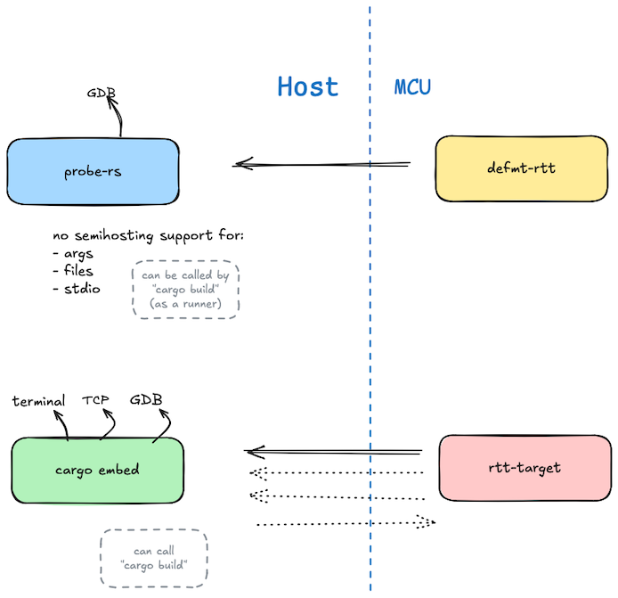

# Basics

Experimenting with tooling (e.g. semihosting); things that have to do with tooling.

- no additional hardware involved


## Examples

### `abc`

```
$ cargo run --release --example abc
```

Just testing basics: `defmt` logging; semihosting to end the run.

The "hello world" to see that you can flash the MCU and run code on it.


### `prompt` (not succeeded)

It would be great, for example for motor control, to be able to prompt the user in a semihosting-way:

```
Ready to start the motor? (y/N)
Y

Running at 5%; 110rpm

Use '+' and '-' to speed up/down.
{reacting to key presses}
```

There are ways to do this, but the author hasn't found one that works with `defmt` logging. And.. he kind of likes `defmt` so not moving seats.

<!-- Tried #1
- `esp_hal` sample `embassy_usb_serial_jtag`, with two lines changed to use `defmt` macros instead of `esp_println`. 

	Outcome: Compiles, but `defmt` output is not seen.

```diff
--- a/examples/src/bin/embassy_usb_serial_jtag.rs
+++ b/examples/src/bin/embassy_usb_serial_jtag.rs
@@ -8,6 +8,9 @@
 #![no_std]
 #![no_main]
 
+use defmt::{info, error};
+use defmt_rtt as _;
+
 use embassy_executor::Spawner;
 use embassy_sync::{blocking_mutex::raw::NoopRawMutex, signal::Signal};
 use esp_backtrace as _;
@@ -55,14 +58,14 @@ async fn reader(
                 signal.signal(heapless::String::from_utf8(string_buffer).unwrap());
             }
             #[allow(unreachable_patterns)]
-            Err(e) => esp_println::println!("RX Error: {:?}", e),
+            Err(e) => error!("RX Error: {:?}", e),
         }
     }
 }
 
 #[esp_hal_embassy::main]
 async fn main(spawner: Spawner) {
-    esp_println::println!("Init!");
+    info!("Init!");
     let peripherals = esp_hal::init(esp_hal::Config::default());
 
     let timg0 = TimerGroup::new(peripherals.TIMG0);
```
-->

<!-- Tried #2
Semihosting alongside `defmt` (unaware of each other).

The `probe-rs` side of semihosting only implements `exit`, none of the data streaming or input protocols. (Oct'24)
-->

**`#help`**
If you know of a way that input prompting can be made, together with `defmt` logging, please let the author know.


### `channels` (not succeeded)

Channels is for providing additional data streams from the MCU to host, alongside debug logging.

**[`cargo embed`](https://probe.rs/docs/tools/cargo-embed/)** 

..is all about this, but its MCU-side client (`rtt-target`) isn't compatible with `defmt`. So if using `cargo embed`, I'd need to transition all the logging syntax over to `esp_println` - which seems unnecessary, to just have *further* RTT channels in use, keeping the terminal one for `defmt`.

**`#help`**
If you know of a way that additional data channels (MCU -> host) can be made, while keeping logging with `defmt-rtt`, please let the author know.


---
### (Abandoned) `semihosting`

In principle, semihosting would give us meaningful ways to collect data to the host, and interact between the host and the MCU. Unfortunately, as of Oct'24, `probe-rs` has very limited host-side support for it.

|||
|---|---|
|Reading arguments|no|
|Interacting with host file system|no|
|Input from host terminal|no|
|Exiting the host process|yes|

See -> [`../DEVS/Semihosting`](../DEVS/Semihosting.md). 

## Image

Drew this image to show my current understanding of the logging/input/channels situation.



**`#help`**
Corrections / collab on the image is welcome! Part of the problem is that these information are so spread apart - *some* people might have a working system, but finding data about that isn't easy. Properly drawing the image is the same as articulating the problem, properly!


